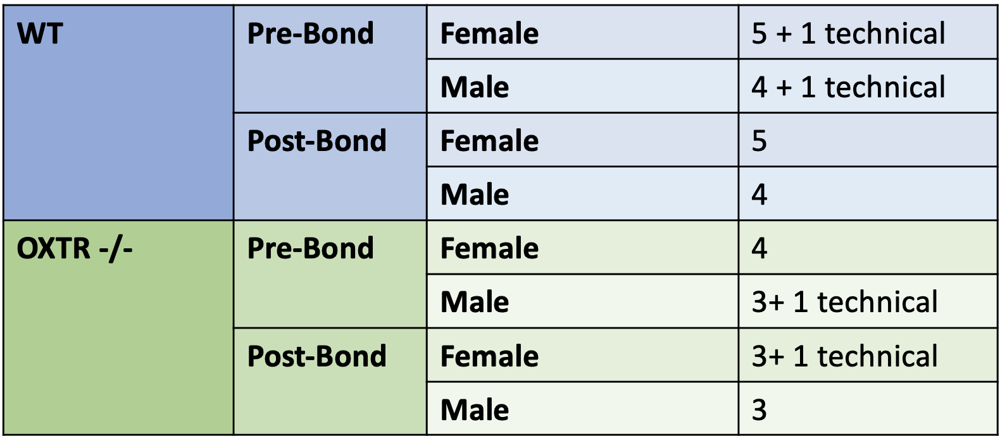

__Author:__ Amanda Everitt    
__Began:__ 07/24/2023   
__Finished:__ 09/29/2024   


## Study Design
Main question of interest:    
- Is there a molecular signature of pair bonding in the nucleus accumbens?    
- How does loss of OXTR in the nucleus accumbens effect gene expression?     
- Do these differ by sex?   

```{r, echo=F, out.width = "500px"}

```

```{css, echo=FALSE}
.summary_box {
  background-color: #C6F6C6;
  border: 3px solid #90EE90;
}
```
```{r}
colorize <- function(x, color) {
  if (knitr::is_latex_output()) {
    sprintf("\\textcolor{%s}{%s}", color, x)
  } else if (knitr::is_html_output()) {
    sprintf("<span style='color: %s;'>%s</span>", color,
      x)
  } else x
}
```

<details>
  <summary>**Alignment + Pre-processing Methods**</summary>
```{}
Adapter and low quality sequence trimming was performed with Trimmomatic v0.39 using parameters: ‘TruSeq3-PE.fa:2:30:10:2:keepBothReads LEADING:3 TRAILING:3 SLIDINGWINDOW:4:20 MINLEN:25’(Bolger et al., 2014). Trimmed RNA-Seq reads were aligned to a custom MicOch1.0 prairie vole genome, which incorporated a known missing gene V1A, using STAR v2.7.3a in gene annotation mode (Dobin et al., 2013). Alignment, RNA-Seq, and Insert Size quality control metrics were generated using Picard v 2.10.10 (http://broadinstitute.github.io/picard). Homologous genes between vole, mouse, and human references were identified using biomart v2.56.1. When multiple mouse or human genes mapped to the same vole gene, the homologous gene with the highest percent identity to vole was selected.
```
</details>

<details>
  <summary>**Load Packages + Set env**</summary>
```{r, class.source = 'fold-show', warning=FALSE}
suppressPackageStartupMessages({
  library(plyr); library(dplyr);
  library(DESeq2)
  library(ggplot2)
  library(tibble)
  library(gridExtra)
  library(purrr)
  library(ggbiplot)
  library(ggVennDiagram)
  library(ComplexHeatmap)
  library(kableExtra)
  library(RUVSeq)
  library(readxl)
  library(fgsea)
  library(Seurat)
  library(ggpubr)
  library(STRINGdb)
  library(clusterProfiler)
  library(ggvenn)
  library(igraph)
  library(circlize)
  library(ggh4x)
})

data_dir ="input_data/"
output_dir = "results/"
dir.create(output_dir, recursive = TRUE, showWarnings = FALSE)
dir.create(paste0(output_dir,"figures"), recursive = TRUE, showWarnings = FALSE)

par(mar=c(1,1,1,1), cex.axis=0.5, mfrow=c(1,1))
set.seed(1)
`%ni%` <- purrr::compose(`!`, `%in%`)
```

```{r}
#Load in metadata + make some helpful columns
metadata <- read.csv(paste0(data_dir,"KB_OXTR_metadata.csv"), header = T, stringsAsFactors = F)
metadata[metadata$species == "Prairie",]$species <- "WT"
metadata$FullID <- gsub("-bond","", paste0(metadata$SampleID, "_",metadata$species, "_",
                                           metadata$Condition, "_", metadata$Sex))
rownames(metadata) <- metadata$FullID
metadata$SeqRun <- as.character(metadata$SeqRun)
metadata$Group <- paste0(ifelse(metadata$species == "WT", "wildtype","oxtr"), "_", 
                         ifelse(metadata$Sex == "F", "female","male"), "_", 
                         ifelse(metadata$Condition == "Post-bond", "post-bonding","pre-bonding"))
metadata$TechnicalRep <- as.character(metadata$TechnicalRep)
metadata$Condition <- as.factor(metadata$Condition)
```

```{r}
#Load counts
cts <- read.delim(paste0(data_dir,"trim_star2.7.3a_merged_counts.txt"), sep = "\t", row.names = 1)
cts <- cts[,order(match(colnames(cts), metadata$SampleID)),]
colnames(cts) <- metadata$FullID
original_cts <- cts
```

```{r, warning=FALSE}
#Load QC metrics
qc1 <- t(read.delim(paste0(data_dir,"trim_star2.7.3a_merged_counts.stats"), sep = "\t", row.names = 1))
qc2 <- read.delim(paste0(data_dir,"merged_qc.txt"), sep = "\t", row.names = 1)
qc3 <- merge(qc1, qc2, by="row.names", all=T)
qc_df <- merge(metadata[,c("SampleID", "FullID"), drop=F], qc3, by.x="SampleID", by.y="Row.names")
rownames(qc_df) <- qc_df$FullID
qc_df <- qc_df[, colnames(qc_df) %ni% c("SampleID", "FullID")]

qc_df <- qc_df[, as.numeric(which(apply(qc_df, 2, var) > 0 ))] #remove cols with no variance
qc_df <- as.data.frame(t(qc_df))
if(identical(colnames(qc_df), colnames(cts))){
  qc_df["N_reads_mapped", ] <- colSums(cts)
}
```

```{r}
metadata[1:3,]
cts[1:3,1:4]
qc_df[1:3,1:4]
```
</details>

<details>
  <summary>**Building vole annotation**</summary>
```{r, class.source = 'fold-show', eval=FALSE}
library("biomaRt")
voleGenes <- rownames(original_cts)
vole = useMart("ensembl", dataset = "mochrogaster_gene_ensembl")
#searchAttributes(mart = vole, pattern = "mochrogaster")

#need ensemblIDs for GO, need entrez IDs for GSEA
vole_homolgsPage = getBM(attributes = c("ensembl_gene_id",
                                   "mmusculus_homolog_ensembl_gene",
                                   "mmusculus_homolog_associated_gene_name",
                                   "mmusculus_homolog_orthology_type",
                                   "mmusculus_homolog_perc_id",
                                   "hsapiens_homolog_ensembl_gene",
                                   "hsapiens_homolog_associated_gene_name",
                                   "hsapiens_homolog_orthology_type",
                                   "hsapiens_homolog_perc_id"), 
                   filters = "ensembl_gene_id", 
                   values = voleGenes, mart=vole)

table(duplicated(vole_homolgsPage$ensembl_gene_id))
#FALSE  TRUE 
#23038 10229
```

- Downstream we need each vole gene to have one ortholog which is a problem with the  1:many and many:many orthologs. I'm going to order information by the percent identity, but retain the rest of the info in other columns in case people would like to redo this later with different criteria. 

```{r, class.source = 'fold-show', eval=FALSE}
dups <- vole_homolgsPage$ensembl_gene_id[duplicated(vole_homolgsPage$ensembl_gene_id)]
length(unique(dups))
#[1] 1245
 
#lets handle the mouse duplicated instances first. 
pt1 <- vole_homolgsPage[vole_homolgsPage$ensembl_gene_id %in% dups, ] %>% 
  group_by(ensembl_gene_id) %>% #group by the vole unique ID
  arrange(desc(mmusculus_homolog_perc_id)) %>% # for each group, arrange by the one we're "most confident" in 
  reframe(mmusculus_homolog_ensembl_genes = paste(mmusculus_homolog_ensembl_gene, collapse=", "),
          mmusculus_homolog_associated_gene_names = paste(mmusculus_homolog_associated_gene_name, collapse=", "),
          mmusculus_homolog_perc_ids = paste(mmusculus_homolog_perc_id, collapse=", "),
          mmusculus_homolog_ensembl_gene = mmusculus_homolog_ensembl_gene[[1]],
          mmusculus_homolog_associated_gene_name = mmusculus_homolog_associated_gene_name[[1]],
          mmusculus_homolog_orthology_type = mmusculus_homolog_orthology_type[[1]],
          mmusculus_homolog_perc_id = mmusculus_homolog_perc_id[[1]]) %>% #collapse info we want to keep. 
  unique()

length(pt1$ensembl_gene_id)
#[1] 1245


#lets handle the mouse duplicated instances first. 
pt2 <- vole_homolgsPage[vole_homolgsPage$ensembl_gene_id %in% dups, ] %>% 
  group_by(ensembl_gene_id) %>% #group by the vole unique ID
  arrange(desc(hsapiens_homolog_perc_id)) %>% # for each group, arrange by the one we're "most confident" in 
  reframe(hsapiens_homolog_ensembl_genes = paste(hsapiens_homolog_ensembl_gene, collapse=", "),
          hsapiens_homolog_associated_gene_names = paste(hsapiens_homolog_associated_gene_name, collapse=", "),
          hsapiens_homolog_perc_ids = paste(hsapiens_homolog_perc_id, collapse=", "),
          hsapiens_homolog_ensembl_gene = hsapiens_homolog_ensembl_gene[[1]],
          hsapiens_homolog_associated_gene_name = hsapiens_homolog_associated_gene_name[[1]],
          hsapiens_homolog_orthology_type = hsapiens_homolog_orthology_type[[1]],
          hsapiens_homolog_perc_id = hsapiens_homolog_perc_id[[1]]) %>% #collapse info we want to keep. 
  unique()

length(pt2$ensembl_gene_id)
#[1] 1245
```

```{r, class.source = 'fold-show', eval=FALSE}
fixed = full_join(pt1,pt2)
vole_homolgsPage_fixed <- full_join(vole_homolgsPage[vole_homolgsPage$ensembl_gene_id %ni% dups, ], fixed)
```

```{r, class.source = 'fold-show', eval=FALSE}
#now we have to add the entrezIDs for mouse and humans for the retained ensembl IDs. 
vole_featurePage = getBM(attributes = c("ensembl_gene_id",  
                                        "gene_biotype", "entrezgene_id", "external_gene_name"), 
                   filters = "ensembl_gene_id", 
                   values = voleGenes, 
                   mart=vole)

mouse = useMart("ensembl", dataset = "mmusculus_gene_ensembl")
mouse_featurePage = getBM(attributes = c("ensembl_gene_id",  "entrezgene_id"), 
                   filters = "ensembl_gene_id", 
                   values = unique(vole_homolgsPage_fixed$mmusculus_homolog_ensembl_gene), 
                   mart=mouse)

human = useMart("ensembl", dataset = "hsapiens_gene_ensembl")
human_featurePage = getBM(attributes = c("ensembl_gene_id",  "entrezgene_id"), 
                   filters = "ensembl_gene_id", 
                   values = unique(vole_homolgsPage_fixed$hsapiens_homolog_ensembl_gene), 
                   mart=human)
```

```{r, class.source = 'fold-show', eval=FALSE}
vole_featurePage_uniq <- vole_featurePage %>% 
  group_by(ensembl_gene_id) %>% 
  reframe(entrezgene_ids = paste(entrezgene_id, collapse=", "),
          external_gene_names = paste(external_gene_name, collapse=", "),
          gene_biotype = gene_biotype[[1]],
          entrezgene_id = entrezgene_id[[1]], 
          external_gene_name = external_gene_name[[1]]) %>%
  unique()

mouse_featurePage_uniq <- mouse_featurePage %>% 
  group_by(ensembl_gene_id) %>% 
  reframe(mmusculus_entrezgene_ids = paste(entrezgene_id, collapse=", "),
          mmusculus_entrezgene_id = entrezgene_id[[1]],
          mmusculus_homolog_ensembl_gene = ensembl_gene_id) %>%
  unique()

human_featurePage_uniq <- human_featurePage %>% 
  group_by(ensembl_gene_id) %>% 
  reframe(hsapiens_entrezgene_ids = paste(entrezgene_id, collapse=", "),
          hsapiens_entrezgene_id = entrezgene_id[[1]],
          hsapiens_homolog_ensembl_gene = ensembl_gene_id) %>%
  unique()
```

```{r, class.source = 'fold-show', eval=FALSE}
m0 <- full_join(vole_featurePage_uniq, vole_homolgsPage_fixed)
m1 <- full_join(m0, mouse_featurePage_uniq[,2:4])
m2 <- full_join(m1, human_featurePage_uniq[,2:4])

table(duplicated(m2$ensembl_gene_id))
#FALSE 
#23038 

write.csv(m2, file=paste0(data_dir, "vole_annotation.csv"))
```
```{r}
vole_annotation <- read.csv(paste0(data_dir, "vole_annotation.csv"), row.names = 1) 
```
</details>


## QC, Filtering, and Data Viz

Based on clustering with a separate dataset not discussed here, we discovered one of the samples is actually from a different brain region. Removing KB11 before our normalization. 
```{r class.source = 'fold-show'}
cts <- cts[,colnames(cts) %ni% c("KB11_WT_Post_M")]
metadata <- metadata[rownames(metadata) %ni% c("KB11_WT_Post_M"),]
qc_df <- qc_df[,colnames(qc_df) %ni% c("KB11_WT_Post_M")]
```


```{r, fig.height=7, fig.width=12}
#Is there anything concerning in how the reads were mapped to the genome?
#no. 
par(cex=1, mar = c(10,5,3,1), xpd=TRUE)
a<- as.matrix(qc_df[rownames(qc_df) %in% c("N_reads_mapped", "N_unmapped","N_multimapping","N_noFeature","N_ambiguous"),])
barplot(a, main="Breakdown of Read distribution by sample",
  col=c("orange","pink", "red","green","darkblue"),
 	legend = rownames(a),
  las=2, 
  args.legend = list(x="bottomright", cex=0.5) )
```
```{r, warning=FALSE}
pca <- prcomp(t(qc_df), center = T, scale. = T)
percentVar <- pca$sdev^2/sum(pca$sdev^2)
metadata %>%
    mutate(PC1 = pca$x[, 1], PC2 = pca$x[, 2]) %>% 
    ggplot(aes(x = PC1, y = PC2, color=SeqRun, shape=species, label=SampleID)) +
    geom_point(size = 3) + 
    coord_fixed() + theme_bw() +
    xlab(paste0("PC1: ", round(percentVar[1] * 100), "% variance")) + 
    ylab(paste0("PC2: ", round(percentVar[2] * 100), "% variance")) + 
    ggtitle("PCA of QC metrics") +
    geom_text(size=4, nudge_x = 0.5)
```
```{r, fig.height=7, fig.width=7}
ggbiplot(pca) + theme_bw() + ggtitle("Biplot showing qc metrics + loadings")
```

#### Filter zero + lowly expressed genes out. 
```{r}
amanda.plot.density <- function(df, title, my.ylim, my.xlim){
  library(RColorBrewer)
  colramp= colorRampPalette(brewer.pal(4, "BuPu"))(ncol(df))
  plot(density(df[,1]),col="white",lwd=3,ylim=my.ylim, xlim=my.xlim, main=title)
  for(i in 1:ncol(df)){lines(density(df[,i]),lwd=1,col=colramp[i])}
}
```

```{r}
par(cex=1, mar = c(3,3,3,3), xpd=FALSE, mfrow=c(3,1))
cpm <- apply(cts,2, function(x) (x/sum(x))*1000000)
amanda.plot.density(log2(cpm + 1), 
                    title=paste0("Original counts (n=",dim(cpm)[1],")"), 
                    my.ylim =c(0,0.5),  my.xlim= c(-1,15))
cpm <- cpm[rowSums(cpm) > 0,]
amanda.plot.density(log2(cpm + 1), 
                    title=paste0("Zero removed counts (n=",dim(cpm)[1],")"), 
                    my.ylim =c(0,0.5),  my.xlim= c(-1,15))
cpm <- cpm[rowSums(cpm > 2) >= 3,]
amanda.plot.density(log2(cpm + 1), 
                    title=paste0("LowExpr filtered counts (n=",dim(cpm)[1],")\n[required > 2 cpm in >= 3 samples]"),
                    my.ylim =c(0,0.5),  my.xlim= c(-1,15))

norm_counts <- log2(cpm + 1)
cts <- cts[rownames(cts) %in% rownames(norm_counts), ] #remove those filtered out. 
```

```{r}
pca <- prcomp(t(norm_counts), center = T)
percentVar <- pca$sdev^2/sum(pca$sdev^2)
pc1lab = paste0("PC1: ", round(percentVar[1] * 100), "% variance"); 
pc2lab = paste0("PC2: ", round(percentVar[2] * 100), "% variance")
cts_pca = metadata %>% mutate(PC1 = pca$x[, 1], PC2 = pca$x[, 2])
```

```{r}
ggplot(cts_pca, aes(x = PC1, y = PC2, color=SeqRun, shape=species, label=SampleID)) +
    geom_point(size = 3) + coord_fixed() + xlab(pc1lab) + ylab(pc2lab) + theme_bw() +
    ggtitle("Initial PCA") + 
    geom_text(size=4, nudge_x = 0.5)
```

```{r}
ggplot(cts_pca, aes(x = PC1, y = PC2, color=species, shape=SeqRun, label=SampleID)) +
    geom_point(size = 3) + coord_fixed() + xlab(pc1lab) + ylab(pc2lab) + theme_bw() +
    ggtitle("Initial PCA: KO effect clear")
```

How did our technical replicates fair?
```{r}
cts_pca$Pairs <- "NA"
cts_pca[cts_pca$SampleID %in% c("KB02","KB26"), "Pairs"] <- 1
cts_pca[cts_pca$SampleID %in% c("KB06","KB27"), "Pairs"] <- 2
cts_pca[cts_pca$SampleID %in% c("KB17","KB29"), "Pairs"] <- 3
cts_pca[cts_pca$SampleID %in% c("KB20","KB28"), "Pairs"] <- 4
cts_pca[cts_pca$Pairs != "NA", c("SampleID", "Pairs")] %>% arrange(Pairs)
```

```{r}
ggplot(cts_pca, aes(x = PC1, y = PC2, color=Pairs, shape=SeqRun)) +
    geom_point(size = 3) + coord_fixed() + xlab(pc1lab) + ylab(pc2lab) + theme_bw() +
    ggtitle("Technical Replicates cluster with mate") +
    scale_color_manual(values=c("#F8766D", "#D89000", "#00B0F6", "#9590FF", "black")) +
    ggrepel::geom_text_repel(data=cts_pca[!is.na(cts_pca$TechnicalRep),], aes(label=SampleID), nudge_x= 2, show.legend = F, size=3)
```


```{r}
#How is the data structured if we look at the groups of samples?
ggplot(cts_pca, aes(x = PC1, y = PC2, color=Group, shape=SeqRun, label=SampleID)) +
    geom_point(size = 3) + coord_fixed() + xlab(pc1lab) + ylab(pc2lab) + theme_bw() +
    ggtitle("PCA colored by sample group") +
    ggrepel::geom_text_repel(nudge_x= 1, show.legend = F, size=3)
```

```{r}
#very ugly code, sorry everyone.
norm_counts_aveTechRep <- as.data.frame(norm_counts)
norm_counts_aveTechRep[,"KB0226_WT_Pre_F"] <- unlist(rowMeans(norm_counts_aveTechRep[,c("KB02_WT_Pre_F", "KB26_WT_Pre_F")]))
norm_counts_aveTechRep[,"KB0627_WT_Pre_M"] <- unlist(rowMeans(norm_counts_aveTechRep[,c("KB06_WT_Pre_M", "KB27_WT_Pre_M")]))
norm_counts_aveTechRep[,"KB1729_Mut6_Pre_M"] <- unlist(rowMeans(norm_counts_aveTechRep[,c("KB17_Mut6_Pre_M", "KB29_Mut6_Pre_M")]))
norm_counts_aveTechRep[,"KB2028_Mut6_Post_F"] <- unlist(rowMeans(norm_counts_aveTechRep[,c("KB20_Mut6_Post_F", "KB28_Mut6_Post_F")]))

norm_counts_aveTechRep <- norm_counts_aveTechRep[, !colnames(norm_counts_aveTechRep) %in% c("KB02_WT_Pre_F", "KB26_WT_Pre_F","KB06_WT_Pre_M", "KB27_WT_Pre_M", "KB17_Mut6_Pre_M", "KB29_Mut6_Pre_M", "KB20_Mut6_Post_F", "KB28_Mut6_Post_F")]
dim(norm_counts_aveTechRep)

pca <- prcomp(t(norm_counts_aveTechRep), center = T)
percentVar <- pca$sdev^2/sum(pca$sdev^2)
pc1lab = paste0("PC1: ", round(percentVar[1] * 100), "% variance"); 
pc2lab = paste0("PC2: ", round(percentVar[2] * 100), "% variance")

tmp <- data.frame(PC1 = pca$x[, 1], PC2 = pca$x[, 2])
tmp$name = rownames(tmp)
tmp$group = as.factor(
  sapply(strsplit(tmp$name, "_", fixed=T), function(x) paste0(x[[2]],x[[4]]))
)
tmp$group <- factor(tmp$group, levels = c("WTF", "WTM","Mut6F","Mut6M"))
tmp$Condition = as.factor(
  sapply(strsplit(tmp$name, "_", fixed=T), function(x) x[[3]])
)
tmp$Condition <- factor(tmp$Condition, levels = c("Pre", "Post"))  

g1 <- ggplot(tmp, aes(x = PC1, y = PC2, color=group, shape=Condition)) +
    geom_point(size = 5) + coord_fixed() + xlab(pc1lab) + ylab(pc2lab) + 
    theme_bw() +
    ggtitle("Principal Component Analysis of RNA-seq") +
    scale_shape_manual(values=c(16, 17), name="", 
                       lab=c("pre-pairing", "post-pairing")) +
    scale_color_manual(values=c("#bf083d", "#2b4599", "#ff96a1", "#b3ccff"), name="", 
                       lab=c("WT female", "WT male", expression(bold(OXTR^"1-/-"~female)), expression(bold(OXTR^"1-/-"~male)))) +
    theme(text=element_text(size=14, face = "bold"), 
          legend.text.align = 0)
ggsave(plot=g1, file=paste0(output_dir, "figures/Supp5A_PCA.svg"), width=10, height=10)
g1
```


<details>
  <summary>**PCAs split by Mutation status**</summary>

```{r}
amanda_quickPCA <- function(keep, my_color="Condition", my_shape="species"){
  my_color=sym(my_color); my_shape=sym(my_shape)
  pca <- prcomp(t(norm_counts[, colnames(norm_counts) %in% keep ]), center = T)
  percentVar <- pca$sdev^2/sum(pca$sdev^2)
  g1 <- metadata %>%
    filter(FullID %in% keep) %>%
    mutate(PC1 = pca$x[, 1], PC2 = pca$x[, 2]) %>% 
    ggplot(aes(x = PC1, y = PC2, label=FullID, color=!!my_color, shape=!!my_shape)) +
    geom_point(size = 3)  + theme_bw() +
    xlab(paste0("PC1: ", round(percentVar[1] * 100), "% variance")) + 
    ylab(paste0("PC2: ", round(percentVar[2] * 100), "% variance")) + 
    ggrepel::geom_text_repel(nudge_x= 1, show.legend = F, size=3) 
  return(g1)
}
```

```{r, fig.height=10, fig.width=10}
g1 = amanda_quickPCA(keep = metadata %>% filter(species=="WT") %>% pull("FullID"), my_color="Sex", my_shape = "species") +
  ggtitle("WT samples [F v M]") 
g2 = amanda_quickPCA(keep = metadata %>% filter(species=="WT") %>% pull("FullID"), my_color="Condition", my_shape = "Sex") +
    ggtitle("WT samples [Pre v Post]") + scale_color_manual(values=c("orange","purple"))


g3 = amanda_quickPCA(keep = metadata %>% filter(species=="Mut6") %>% pull("FullID"), my_color="Sex", my_shape = "species") +
  ggtitle("Mut samples [F v M]") 
g4 = amanda_quickPCA(keep = metadata %>% filter(species=="Mut6") %>% pull("FullID"), my_color="Condition", my_shape = "Sex") +
    ggtitle("Mut samples [Pre v Post]") + scale_color_manual(values=c("orange","purple"))

grid.arrange(g1,g2, g3, g4, ncol=2)
```

</details>

<details>
  <summary>**PCAs split into subgroups**</summary>
  
Note: plots are tiny but on html you can zoom in. 
```{r, fig.height=5, fig.width=20}
g1 = amanda_quickPCA(keep = metadata %>% filter(species=="WT", Sex=="F") %>% pull("FullID"), 
                     my_color="Condition", my_shape = "species") +
  ggtitle("WT Female [Pre v Post]") + scale_color_manual(values=c("orange","purple"))

g2 = amanda_quickPCA(keep = metadata %>% filter(species=="WT", Sex=="M") %>% pull("FullID"), 
                     my_color="Condition", my_shape = "species") +
  ggtitle("WT Male [Pre v Post]") + scale_color_manual(values=c("orange","purple"))

g3 = amanda_quickPCA(keep = metadata %>% filter(species=="Mut6", Sex=="F") %>% pull("FullID"), 
                     my_color="Condition", my_shape = "species") +
  ggtitle("Mut Female [Pre v Post]") + scale_color_manual(values=c("orange","purple"))

g4 = amanda_quickPCA(keep = metadata %>% filter(species=="Mut6", Sex=="M") %>% pull("FullID"), 
                     my_color="Condition", my_shape = "species") +
  ggtitle("Mut Male [Pre v Post]") + scale_color_manual(values=c("orange","purple"))

grid.arrange(g1,g2,g3,g4, ncol=4)
```

```{r, fig.height=5, fig.width=20}
g1 = amanda_quickPCA(keep = metadata %>% filter(species=="WT", Condition=="Pre-bond") %>% pull("FullID"), 
                     my_color="Sex", my_shape = "species") +
  ggtitle("WT Pre-bond [F v M]") 

g2 = amanda_quickPCA(keep = metadata %>% filter(species=="WT", Condition=="Post-bond") %>% pull("FullID"), 
                     my_color="Sex", my_shape = "species") +
  ggtitle("WT Post-bond [F v M]") 

g3 = amanda_quickPCA(keep = metadata %>% filter(species=="Mut6", Condition=="Pre-bond") %>% pull("FullID"), 
                     my_color="Sex", my_shape = "species") +
  ggtitle("Mut Pre-bond [F v M]") 

g4 = amanda_quickPCA(keep = metadata %>% filter(species=="Mut6", Condition=="Post-bond") %>% pull("FullID"), 
                     my_color="Sex", my_shape = "species") +
  ggtitle("Mut Post-bond [F v M]") 

grid.arrange(g1,g2,g3,g4, ncol=4)
```
</details>

Let's save our normalized + filtered counts. 
```{r class.source = 'fold-show'}
#write.csv(cts, file=paste0(output_dir, "filtered_counts.csv"))
write.csv(norm_counts, file=paste0(output_dir, "norm_counts.csv"))
```

```{r, class.output = "summary_box"}
print("Summary: No noticeable outliers by either QC metrics or gene expression. Technical replicates all cluster with mate. Slight effect of sequencing batch to control for. Based on PCA, there seems to be a moderate effect of the mutation and less for bonding -- this should be reflected in the DEX.")
```


## Differential Expression

There are three things we need to take into account:    
- Unwanted variation by sequencing batch    
- Collapsing technical replicates   
- DESeq2 model w/ 3 interaction terms   


**Control for Sequencing Batch**   
- Option A is to recode the Sequencing Batch from 1/2/3 as a/b/c and add it into the deseq2 model.    
- Option B is to estimate a continuous factor of unwanted variation (sequencing batch + other things we don't know about). I prefer option B because our model matrix might get complicated in deseq2 and it will be easier if this is continuous.      

```{r, fig.height=10}
set <- newSeqExpressionSet(as.matrix(cts), phenoData = metadata)
x = as.factor(metadata$SeqRun) #unwanted variation we're aware of. 
colors <- brewer.pal(length(unique(x)), "Set2")
set1 <- betweenLaneNormalization(set, which="upper")

#What does our data look like now. 
#par(cex=1, mar = c(3,3,3,3), xpd=FALSE, mfrow=c(2,1))
#plotRLE(set, outline=FALSE, ylim=c(-4, 4), col=colors[x])
#plotRLE(set1, outline=FALSE, ylim=c(-4, 4), col=colors[x], las=2)
```

```{r, fig.width=10, results = "hide", message=FALSE}
#Estimating factors using replicates
set2 <- RUVs(set1, rownames(cts), k=1, makeGroups(metadata$Group))

#Estimating factors using residuals
design <- model.matrix(~Group, data=pData(set))
y <- DGEList(counts=counts(set), group=x)
y <- calcNormFactors(y, method="upperquartile")
y <- estimateGLMCommonDisp(y, design)
y <- estimateGLMTagwiseDisp(y, design)

fit <- glmFit(y, design)
res <- residuals(fit, type="deviance")
set3 <- RUVr(set1, rownames(cts), k=1, res)

par(cex=1, mar = c(3,3,3,3), xpd=FALSE, mfrow=c(1,3))
plotPCA(set1, col=colors[x], cex=0.8) + title("Before")
plotPCA(set2, col=colors[x], cex=0.8) + title("RUVs -- replicates")
plotPCA(set3, col=colors[x], cex=0.8) + title("RUVr -- residuals")
```

**Technical Replicates**    
- "collapseReplicates can assist in combining the counts from technical replicates into single columns of the count matrix." -- deseq2   

**DESeq2 model**    
- In an initial version of this I used the full three factor linear model      
y=$\beta_{0}$ + $\beta_{1}$Batch + $\beta_{2}$Genotype + $\beta_{3}$Bonding + $\beta_{4}$Sex + $\beta_{5}$Genotype:Bonding + $\beta_{5}$Genotype:Sex + $\beta_{6}$Bonding:Sex +  $\beta_{7}$Genotype:Bonding:Sex   

I found the 2nd and 3rd order interactions effect were small compared to the first order, so going forward I'm just going to make designs with group variables that fit each question.    

```{r}
#FUNCTIONS
amanda.volcano.plot <- function(results, title, gene.list=NA, FCcut = 0, Padjcut = 0.05){
    results <- data.frame(results)
    results <- results[!is.na(results$padj) & !is.na(results$log2FoldChange) ,]
    results$sig <- as.factor(ifelse(results$padj <= Padjcut & abs(results$log2FoldChange) > FCcut, "sig", "notsig"))
    to_label <- results[results$external_gene_name %in% gene.list, ]
    p1 <- ggplot(results, aes(x=log2FoldChange, y=-log10(padj), col=sig)) + 
        geom_point(aes(color = sig)) +
        ggtitle(title) +
        xlab("log2FC") + ylab("-log10(padj)") +
        scale_colour_manual(values = c("black", "red3"), name ="", labels=c("not signficant", "significant")) +
        theme_bw() + 
        theme(legend.justification=c(1,0), legend.position=c(1,0), legend.title = element_blank(), 
              legend.background = element_rect(fill="transparent", linewidth=0.5, linetype="solid", color = "black")) +
        ggrepel::geom_text_repel(data=to_label, aes(label=external_gene_name), show.legend = F, size=2) +
        geom_vline(xintercept = c(FCcut,-1*FCcut), color="blue", linetype="dashed", linewidth=0.5) + 
        geom_hline(yintercept = -log10(Padjcut), color="blue", linetype="dashed", linewidth=0.5) +
        NULL
    return(p1)
}

amanda.quick.boxplots <- function(df, genename, my.title, group.var, my.order=NULL){
  d<- data.frame(t(df[genename, , drop=F]))
  d$group <- metadata[order(metadata$FullID[metadata$SampleID %in% rownames(d)], rownames(d)), group.var]
  colnames(d) <- c("gene", "group")
  d$group <- as.factor(d$group)
  if (!is.null(my.order)){d$group <- factor(d$group, levels=my.order)}
  g1 <- ggplot(d, aes(x=group, y=gene, fill=group)) + 
    geom_boxplot() + 
    geom_jitter(color="black", size=2, alpha=0.5, width = 0.1) +
    ggtitle(my.title) + 
    ylab("Normalized Gene Expression") + 
    xlab("") +
    theme_bw() +
    theme(plot.title = element_text(hjust = 0.5, face="bold", size=12), 
          legend.position = "none", axis.text.x = element_text(angle = 45, hjust = 1)) +
    NULL
  return(g1)
}
```

```{r}
#Data cleaning for deseq

#swap characters so deseq doesn't yell at me. 
pData(set3)[, "Condition"] <- gsub("-", "_", pData(set3)[, "Condition"]) 

keep = c("species", "Condition", "Sex")
pData(set3)[,keep] <- lapply(pData(set3)[,keep] , factor)
pData(set3)[,"species"] <- relevel(pData(set3)[,"species"], ref = "WT")
pData(set3)[,"Condition"] <- relevel(pData(set3)[,"Condition"], ref = "Pre_bond")
pData(set3)[,"Sex"] <- relevel(pData(set3)[,"Sex"], ref = "F")


#Make a column so we can collapse technical replicates later
pData(set3)[pData(set3)$SampleID == "KB29", ]$SampleID <- "KB17"
pData(set3)[pData(set3)$SampleID == "KB28", ]$SampleID <- "KB20"
pData(set3)[pData(set3)$SampleID == "KB27", ]$SampleID <- "KB06"
pData(set3)[pData(set3)$SampleID == "KB26", ]$SampleID <- "KB02"
```

### Q1: What is the bonding effect? {.tabset}

y =$\beta_{0}$ + $\beta_{1}$Batch + $\beta_{2}$Bonding    

```{r, results = "hide", message=FALSE}
dds <- DESeqDataSetFromMatrix(countData = counts(set3), colData = pData(set3), design = ~ W_1 + Condition )
dds <- collapseReplicates(dds, groupby = dds$SampleID)
dds <- DESeq(dds)
ddsnorm <- counts(dds, normalized=TRUE)
```
```{r}
res = lfcShrink(dds, type="ashr", contrast=list(c("Condition_Post_bond_vs_Pre_bond")), quiet = TRUE)
mydf <- res %>% as.data.frame() %>% 
  rownames_to_column(var="ensembl_gene_id") %>% 
  left_join(vole_annotation, by="ensembl_gene_id")
sig_joint <- mydf %>% filter(!is.na(padj), padj < 0.05) %>% arrange(padj)
```
```{r}
bonding_df <- res[, c("log2FoldChange", "padj", "lfcSE")]; colnames(bonding_df) <- paste0(colnames(bonding_df), "_joint")
bonding_df$ensembl_gene_id = rownames(res)
```

```{r}
metadata$tmp <- paste0(metadata$species, "_", metadata$Sex, "_", metadata$Condition)
myorder = c('WT_F_Pre-bond' ,'WT_F_Post-bond', 'WT_M_Pre-bond', 'WT_M_Post-bond' ,
          'Mut6_F_Pre-bond', 'Mut6_F_Post-bond' ,'Mut6_M_Pre-bond', 'Mut6_M_Post-bond')
myorder2 = c("Pre-bond", "Post-bond")
```

#### DEX Table
```{r}
cat("Number of DEX genes:", nrow(sig_joint))
sig_joint %>% 
  kbl() %>%
  kable_styling(bootstrap_options = c("striped", "hover", "condensed")) %>% 
  scroll_box(width = "800px", height = "400px")
```

#### Volcano Plot
```{r}
amanda.volcano.plot(mydf, title = " ", 
                    gene.list = mydf %>% arrange(padj) %>% head(n=25) %>% pull(external_gene_name), 
                    FCcut = 0)
```

#### Selected Gene Plot
```{r, fig.width=12}
id = sig_joint %>% arrange(desc(abs(log2FoldChange))) %>% head(n=6) %>% pull(ensembl_gene_id)
name = sig_joint %>% arrange(desc(abs(log2FoldChange))) %>% head(n=6) %>% pull(external_gene_name)

d <- ddsnorm %>% 
    data.frame() %>%
    filter(row.names(ddsnorm) %in% id[1:6]) %>%
    t() %>% data.frame() %>% 
    rownames_to_column() %>%
    tidyr::pivot_longer(cols=-c(rowname), values_to='expr', names_to='gene') %>%
    left_join(metadata[,c("SampleID", "Condition")], by=c("rowname"="SampleID")) %>%
    left_join(vole_annotation[,c("ensembl_gene_id", "external_gene_name")], by=c("gene"="ensembl_gene_id"))
d$Condition <- as.factor(d$Condition)
d$Condition <- factor(d$Condition, levels=c("Pre-bond", "Post-bond"))
d$external_gene_name <- as.factor(d$external_gene_name)
d$external_gene_name <- factor(d$external_gene_name, levels=name)

g1 <- ggplot(d, aes(x=Condition, y=log2(expr), fill=Condition)) + 
    geom_boxplot() + 
    geom_jitter(color="black", size=2, alpha=0.5, width = 0.1) +
    facet_wrap(~external_gene_name, scales = "free_y") + 
    theme_bw() + xlab("") +
    ylab("log2 Normalized Gene Expression") +   
    ggtitle("Top 6 DE Genes in Pairing") + 
    scale_x_discrete(labels = c("pre-pairing", "post-pairing")) +
    scale_fill_manual(values=c("#087B8B","#E5A024")) +
    theme(text=element_text(size=14, face = "bold"),
          strip.text.x = element_text(size = 16), 
          plot.title = element_text(hjust = 0.5), 
          legend.position = "none", axis.text.x = element_text(angle = 45, hjust = 1)) 
ggsave(plot=g1, file=paste0(output_dir, "figures/Fig5C_BoxPlot.svg"), width=10, height=7)
g1
```


#### MA Plot   
```{r}
l = data.frame(res)
l$sig = ifelse(l$padj > 0.05 | is.na(l$padj), "NS", ifelse(l$log2FoldChange >0, "up", "down"))
l$sig <- as.factor(l$sig); l$sig <- factor(l$sig, levels=c("down", "up", "NS"))
l <- left_join(rownames_to_column(l), vole_annotation[,c("ensembl_gene_id", "external_gene_name")], by=c("rowname" = "ensembl_gene_id"))

g1 <- ggplot(l, aes(x=log2(baseMean), y=log2FoldChange, col=sig)) + 
    geom_point(size=4) + 
    scale_color_manual(values=c("#1465AC", "darkgray"), name="", lab=c(paste0("Down: ",table(l$sig)[["down"]]), "NS")) +
    ylim(c(-0.6, 0.25)) +
    theme_bw() + 
    xlab("Log2 Mean Expression") + ylab("Log2 Fold Change") + 
    ggtitle("Pre- vs Post-pairing MA plot") + 
    guides(color = guide_legend(direction = "horizontal")) +
    ggrepel::geom_text_repel(data=l[l$rowname %in% id[1:6], ], aes(label=external_gene_name), 
                             show.legend = F, size=4, box.padding = 0.5, segment.color = NA) +
    theme(text=element_text(size=14, face = "bold"),
          plot.title = element_text(hjust = 0.5),
          legend.position=c(1, 1.03),
          legend.justification="right")

ggsave(plot=g1, file=paste0(output_dir, "figures/Fig5B_MAPlot.svg"), width=10, height=8)
g1
```

### {-}

<details>
  <summary>**Is the bonding effect different by genotype?**</summary>

- y = $\beta_{0}$ + $\beta_{1}$Batch + $\beta_{2}$Genotype + $\beta_{3}$Bonding + $\beta_{4}$Genotype:Bonding       
- In sum, most dex genes are driven by WT samples, but the trends are maintained in the oxtr -/- individuals. This makes me believe we should use the joint analysis for accuracy + to power our results. 
  

```{r, results = "hide", message=FALSE}
dds <- DESeqDataSetFromMatrix(countData = counts(set3), colData = pData(set3), 
                              design = ~ W_1 + species + Condition + species:Condition)
dds <- collapseReplicates(dds, groupby = dds$SampleID)
dds <- DESeq(dds)
```

```{r}
res = lfcShrink(dds, type="ashr", contrast=list(c("Condition_Post_bond_vs_Pre_bond")), quiet = TRUE)  
sig_WT <- res %>% as.data.frame() %>% 
  rownames_to_column(var="ensembl_gene_id") %>% 
  filter(!is.na(padj), padj < 0.05) 
tmp <- res[, c("log2FoldChange", "padj", "lfcSE")]; colnames(tmp) <- paste0(colnames(tmp), "_WT")
bonding_df <- cbind(bonding_df, tmp)


res = lfcShrink(dds, type="ashr", contrast=list(c("Condition_Post_bond_vs_Pre_bond", "speciesMut6.ConditionPost_bond")), quiet = TRUE)  
sig_MUT <- res %>% as.data.frame() %>% 
  rownames_to_column(var="ensembl_gene_id") %>% 
  filter(!is.na(padj), padj < 0.05) 
tmp <- res[, c("log2FoldChange", "padj", "lfcSE")]; colnames(tmp) <- paste0(colnames(tmp), "_MUT")
bonding_df <- cbind(bonding_df, tmp)
```

```{r, fig.width=12}
x = list(
    "joint"=sig_joint$ensembl_gene_id, 
    "WT"=sig_WT$ensembl_gene_id, 
    "MUT"=sig_MUT$ensembl_gene_id
)
g1 <- ggVennDiagram(x, label_alpha = 0, label="count") + 
  scale_fill_gradient(low="blue",high = "yellow") + 
  scale_color_manual(values = c(rep("black",3))) + 
  theme(legend.position="none") + ggtitle("Pre v Post bonding")
```

```{r}
tmp <- left_join(data.frame(bonding_df), vole_annotation, by="ensembl_gene_id")

tmp$sig <- "neither"
tmp[tmp$ensembl_gene_id %in% intersect(sig_joint$ensembl_gene_id, sig_WT$ensembl_gene_id), "sig"] <- "both"
tmp[tmp$ensembl_gene_id %in% setdiff(sig_joint$ensembl_gene_id, sig_WT$ensembl_gene_id), "sig"] <- "joint"
tmp[tmp$ensembl_gene_id %in% setdiff(sig_WT$ensembl_gene_id, sig_joint$ensembl_gene_id), "sig"] <- "WT_only"
tmp$sig <- as.factor(tmp$sig)
tmp$sig <- factor(tmp$sig, levels = c("both","joint", "WT_only", "neither"))

tolabel <- tmp[tmp$sig %ni% "neither", ]
tolabel$tmp <- ifelse(tolabel$external_gene_name == "", tolabel$ensembl_gene_id, tolabel$external_gene_name)

g2 <- ggplot(tmp, aes(x=abs(log2FoldChange_joint), y=abs(log2FoldChange_WT), color=sig)) + 
    geom_point() + theme_bw() + 
    geom_abline(slope=1, intercept=0, color="black", linetype="dashed", linewidth=0.5) + 
    ylim(c(0,1)) + xlim(c(0,1)) + 
    scale_color_manual(values=c("#E69F00", "#56B4E9", "darkgreen", "#DDDDDD"), name = "significance @ \npadj < 0.05") +
    ggrepel::geom_text_repel(data=tolabel, aes(label=tmp), show.legend = F, size=2) 
```

```{r, fig.width=12}
grid.arrange(g1,g2,ncol=2, widths=c(1,3))
```

</details>


<details>
  <summary>**Is the bonding effect different by sex?**</summary>

- y = $\beta_{0}$ + $\beta_{1}$Batch + $\beta_{2}$Sex + $\beta_{3}$Bonding + $\beta_{4}$Sex:Bonding   
- In sum, most dex genes are driven by female samples, but the trends are maintained in the male samples. This makes me believe we should use the joint analysis for accuracy + to power our results. The magnitude may just change across sexes.     
  
```{r, results = "hide", message=FALSE}
dds <- DESeqDataSetFromMatrix(countData = counts(set3), colData = pData(set3), 
                              design = ~ W_1 + Sex + Condition + Sex:Condition)
dds <- collapseReplicates(dds, groupby = dds$SampleID)
dds <- DESeq(dds)
```

```{r}
res = lfcShrink(dds, type="ashr", contrast=list(c("Condition_Post_bond_vs_Pre_bond")), quiet = TRUE)  
sig_F <- res %>% as.data.frame() %>% 
  rownames_to_column(var="ensembl_gene_id") %>% 
  filter(!is.na(padj), padj < 0.05) 
tmp <- res[, c("log2FoldChange", "padj", "lfcSE")]; colnames(tmp) <- paste0(colnames(tmp), "_F")
bonding_df <- cbind(bonding_df, tmp)

res = lfcShrink(dds, type="ashr", contrast=list(c("Condition_Post_bond_vs_Pre_bond", "SexM.ConditionPost_bond")), quiet = TRUE)  
sig_M <- res %>% as.data.frame() %>% 
  rownames_to_column(var="ensembl_gene_id") %>% 
  filter(!is.na(padj), padj < 0.05) 
tmp <- res[, c("log2FoldChange", "padj", "lfcSE")]; colnames(tmp) <- paste0(colnames(tmp), "_M")
bonding_df <- cbind(bonding_df, tmp)
```  

```{r}
x = list(
    "F+M"=sig_joint$ensembl_gene_id, 
    "F"=sig_F$ensembl_gene_id, 
    "M"=sig_M$ensembl_gene_id
)

g1 <- ggvenn(x, fill_color = c("#96D3BA", "#F36D42", "#6F5DA8"), show_percentage = FALSE, text_size = 6, set_name_size = 5)
```

```{r}
tmp <- left_join(data.frame(bonding_df), vole_annotation, by="ensembl_gene_id")

tmp$sig <- "neither"
tmp[tmp$ensembl_gene_id %in% intersect(sig_joint$ensembl_gene_id, sig_F$ensembl_gene_id), "sig"] <- "both"
tmp[tmp$ensembl_gene_id %in% setdiff(sig_joint$ensembl_gene_id, sig_F$ensembl_gene_id), "sig"] <- "joint"
tmp[tmp$ensembl_gene_id %in% setdiff(sig_F$ensembl_gene_id, sig_joint$ensembl_gene_id), "sig"] <- "female_only"
tmp$sig <- as.factor(tmp$sig)
tmp$sig <- factor(tmp$sig, levels = c("joint", "both","female_only",  "neither"))

tolabel <- tmp[tmp$sig %ni% "neither", ]
#tolabel$tmp <- ifelse(tolabel$external_gene_name == "", tolabel$ensembl_gene_id, tolabel$external_gene_name)

g2 <- ggplot(tmp, aes(y=abs(log2FoldChange_joint), x=abs(log2FoldChange_F), color=sig)) + 
    geom_abline(slope=1, intercept=0, color="black", linetype="dashed", linewidth=0.3) + 
    geom_point(size=4) + theme_bw() + 
    ylim(c(0,0.8)) + xlim(c(0,0.8)) + 
    xlab("Absolute Log2 Fold-change (F only)") + ylab("Absolute Log2 Fold-change (F+M)") + 
    ggtitle("Pre- vs Post-pairing show sex-specific effect sizes") + 
    scale_color_manual(values=c("#96D3BA","#B1AD57", "#F36D42", "darkgrey"), 
                       lab=c(paste0("F+M (", table(tmp$sig)[[1]],")"),
                             paste0("F and F+M (", table(tmp$sig)[[2]],")"),
                             paste0("F only (", table(tmp$sig)[[3]],")"),
                             "NS"),
                       name = "DEX list") + 
    ggrepel::geom_text_repel(data=tolabel, aes(label=external_gene_name), 
                             show.legend = F, size=3, box.padding = 0.3, segment.color = NA) +
    theme(text=element_text(size=14, face = "bold"),
          plot.title = element_text(hjust = 0.5))

ggsave(plot=grid.arrange(g1,g2,ncol=2, widths=c(1,3)), 
       file=paste0(output_dir, "figures/Fig5D.svg"), width=12, height=7)
```

```{r, fig.width=12}
grid.arrange(g1,g2,ncol=2, widths=c(1,3))
```


</details>


<details>
  <summary>**Is the bonding effect different by sex+genotype?**</summary>
  
- From above we know its WT females driving our effect.  

```{r, results = "hide", message=FALSE}
pData(set3)$group <- paste0(pData(set3)$species, "_", pData(set3)$Sex, "_", gsub("_bond", "", pData(set3)$Condition))
pData(set3)$group <- as.factor(pData(set3)$group)
pData(set3)[,"group"] <- relevel(pData(set3)[,"group"], ref = "WT_F_Pre")

dds <- DESeqDataSetFromMatrix(countData = counts(set3), colData = pData(set3), design = ~ W_1 + group)
dds <- collapseReplicates(dds, groupby = dds$SampleID)
dds <- DESeq(dds)
```

```{r}
res = lfcShrink(dds, type="ashr", contrast=c("group", "WT_F_Post", "WT_F_Pre"), quiet = TRUE)  
sig_WTF <- res %>% as.data.frame() %>% 
  rownames_to_column(var="ensembl_gene_id") %>% 
  filter(!is.na(padj), padj < 0.05) 
tmp <- res[, c("log2FoldChange", "padj", "lfcSE")]; colnames(tmp) <- paste0(colnames(tmp), "_WTF")
bonding_df <- cbind(bonding_df, tmp)

res = lfcShrink(dds, type="ashr", contrast=c("group", "WT_M_Post", "WT_M_Pre"), quiet = TRUE)  
sig_WTM <- res %>% as.data.frame() %>% 
  rownames_to_column(var="ensembl_gene_id") %>% 
  filter(!is.na(padj), padj < 0.05) 
tmp <- res[, c("log2FoldChange", "padj", "lfcSE")]; colnames(tmp) <- paste0(colnames(tmp), "_WTM")
bonding_df <- cbind(bonding_df, tmp)

res = lfcShrink(dds, type="ashr", contrast=c("group", "Mut6_F_Post", "Mut6_F_Pre"), quiet = TRUE)  
sig_MUTF <- res %>% as.data.frame() %>% 
  rownames_to_column(var="ensembl_gene_id") %>% 
  filter(!is.na(padj), padj < 0.05) 
tmp <- res[, c("log2FoldChange", "padj", "lfcSE")]; colnames(tmp) <- paste0(colnames(tmp), "_MUTF")
bonding_df <- cbind(bonding_df, tmp)

res = lfcShrink(dds, type="ashr", contrast=c("group", "Mut6_M_Post", "Mut6_M_Pre"), quiet = TRUE)  
sig_MUTM <- res %>% as.data.frame() %>% 
  rownames_to_column(var="ensembl_gene_id") %>% 
  filter(!is.na(padj), padj < 0.05) 
tmp <- res[, c("log2FoldChange", "padj", "lfcSE")]; colnames(tmp) <- paste0(colnames(tmp), "_MUTM")
bonding_df <- cbind(bonding_df, tmp)
```

```{r, fig.width=15}
x = list(
    "WT_M"=sig_WTM$ensembl_gene_id, 
    "WT_F"=sig_WTF$ensembl_gene_id,
    "MUT_M"=sig_MUTM$ensembl_gene_id, 
    "MUT_F"=sig_MUTF$ensembl_gene_id
)
g1 <- ggVennDiagram(x, label_alpha = 0, label="count") + 
  scale_fill_gradient(low="blue",high = "yellow") + 
  scale_color_manual(values = c(rep("black",4))) + 
  theme(legend.position="none") + ggtitle("Pre v Post bonding")

x = list(
    "group_unions"=unique(c(sig_WTM$ensembl_gene_id, sig_WTF$ensembl_gene_id, 
                              sig_MUTM$ensembl_gene_id, sig_MUTF$ensembl_gene_id)),
    "joint" = sig_joint$ensembl_gene_id
)
g2 <- ggVennDiagram(x, label_alpha = 0, label="count") + 
  scale_fill_gradient(low="blue",high = "yellow") + 
  scale_color_manual(values = c(rep("black",2))) + 
  theme(legend.position="none") + ggtitle("Pre v Post bonding")

grid.arrange(g1,g2, ncol=2)
```


#### {-} {.tabset}
##### MUT_M
- only two genes in the venn diagram above   
- Sema3b seems strong and interesting. It can "function in growth cone guidance during neuronal development" 
```{r, fig.width=12}
g1 <- amanda.quick.boxplots(ddsnorm, "ENSMOCG00000010337", "ENSMOCG00000010337 (human ortho gapdh)", "tmp", myorder) +
  scale_fill_manual(values=c(rep(c("#56B4E9","#E69F00"), 4)))
g2 <- amanda.quick.boxplots(ddsnorm, "ENSMOCG00000010337", "ENSMOCG00000010337 (human ortho gapdh)", "Condition", myorder2) +
  scale_fill_manual(values=c(rep(c("#56B4E9","#E69F00"), 1)))
grid.arrange(g1,g2,ncol=2)
```
```{r, fig.width=12}
g1 <- amanda.quick.boxplots(ddsnorm, "ENSMOCG00000019704", "Sema3b", "tmp", myorder) +
  scale_fill_manual(values=c(rep(c("#56B4E9","#E69F00"), 4)))
g2 <- amanda.quick.boxplots(ddsnorm, "ENSMOCG00000019704", "Sema3b", "Condition", myorder2) +
  scale_fill_manual(values=c(rep(c("#56B4E9","#E69F00"), 1)))
grid.arrange(g1,g2,ncol=2)
```

##### MUT_F
- four genes in the venn diagram above (one of which is Kdr -- repeat of above)     
```{r}
sig_MUTF <- left_join(sig_MUTF, vole_annotation, by="ensembl_gene_id")
```

```{r}
i = 1
g1 <- amanda.quick.boxplots(ddsnorm, 
                            sig_MUTF[i, "ensembl_gene_id"], sig_MUTF[i, "external_gene_name"], 
                            "tmp", myorder) +
  scale_fill_manual(values=c(rep(c("#56B4E9","#E69F00"), 4)))
g2 <- amanda.quick.boxplots(ddsnorm, 
                            sig_MUTF[i, "ensembl_gene_id"], sig_MUTF[i, "external_gene_name"], 
                            "Condition", myorder2) +
  scale_fill_manual(values=c(rep(c("#56B4E9","#E69F00"), 1)))
grid.arrange(g1,g2,ncol=2)
```
```{r}
i = 2
g1 <- amanda.quick.boxplots(ddsnorm, 
                            sig_MUTF[i, "ensembl_gene_id"], sig_MUTF[i, "external_gene_name"], 
                            "tmp", myorder) +
  scale_fill_manual(values=c(rep(c("#56B4E9","#E69F00"), 4)))
g2 <- amanda.quick.boxplots(ddsnorm, 
                            sig_MUTF[i, "ensembl_gene_id"], sig_MUTF[i, "external_gene_name"], 
                            "Condition", myorder2) +
  scale_fill_manual(values=c(rep(c("#56B4E9","#E69F00"), 1)))
grid.arrange(g1,g2,ncol=2)
```
```{r}
i = 3
g1 <- amanda.quick.boxplots(ddsnorm, 
                            sig_MUTF[i, "ensembl_gene_id"], sig_MUTF[i, "external_gene_name"], 
                            "tmp", myorder) +
  scale_fill_manual(values=c(rep(c("#56B4E9","#E69F00"), 4)))
g2 <- amanda.quick.boxplots(ddsnorm, 
                            sig_MUTF[i, "ensembl_gene_id"], sig_MUTF[i, "external_gene_name"], 
                            "Condition", myorder2) +
  scale_fill_manual(values=c(rep(c("#56B4E9","#E69F00"), 1)))
grid.arrange(g1,g2,ncol=2)
```
```{r}
i = 4
g1 <- amanda.quick.boxplots(ddsnorm, 
                            sig_MUTF[i, "ensembl_gene_id"], sig_MUTF[i, "external_gene_name"], 
                            "tmp", myorder) +
  scale_fill_manual(values=c(rep(c("#56B4E9","#E69F00"), 4)))
g2 <- amanda.quick.boxplots(ddsnorm, 
                            sig_MUTF[i, "ensembl_gene_id"], sig_MUTF[i, "external_gene_name"], 
                            "Condition", myorder2) +
  scale_fill_manual(values=c(rep(c("#56B4E9","#E69F00"), 1)))
grid.arrange(g1,g2,ncol=2)
```

##### WT_F

```{r}
tmp <- left_join(data.frame(bonding_df), vole_annotation, by="ensembl_gene_id")

tmp$sig <- "neither"
tmp[tmp$ensembl_gene_id %in% intersect(sig_joint$ensembl_gene_id, sig_WTF$ensembl_gene_id), "sig"] <- "both"
tmp[tmp$ensembl_gene_id %in% setdiff(sig_joint$ensembl_gene_id, sig_WTF$ensembl_gene_id), "sig"] <- "joint"
tmp[tmp$ensembl_gene_id %in% setdiff(sig_WTF$ensembl_gene_id, sig_joint$ensembl_gene_id), "sig"] <- "WT_F"
tmp$sig <- as.factor(tmp$sig)
tmp$sig <- factor(tmp$sig, levels = c("both","joint", "WT_F", "neither"))

tolabel <- tmp[tmp$sig %ni% "neither", ]
tolabel$tmp <- ifelse(tolabel$external_gene_name == "", tolabel$ensembl_gene_id, tolabel$external_gene_name)

ggplot(tmp, aes(x=abs(log2FoldChange_joint), y=abs(log2FoldChange_WTF), color=sig)) + 
    geom_point() + theme_bw() + 
    geom_abline(slope=1, intercept=0, color="black", linetype="dashed", linewidth=0.5) + 
    ylim(c(0,1)) + xlim(c(0,1)) + 
    scale_color_manual(values=c("#E69F00", "#56B4E9", "darkgreen", "#DDDDDD"), name = "significance @ \np < 0.05") +
    ggrepel::geom_text_repel(data=tolabel, aes(label=tmp), show.legend = F, size=2) 
```

- We've seen Gjb6 and Paqr8 above and we're shocked by it. Neither of these genes look good at all. Just how we're slicing the data + variance 

```{r}
g1 <- amanda.quick.boxplots(ddsnorm, "ENSMOCG00000012456", "Abca5", "tmp", myorder) +
  scale_fill_manual(values=c(rep(c("#56B4E9","#E69F00"), 4)))
g2 <- amanda.quick.boxplots(ddsnorm, "ENSMOCG00000012456", "Abca5", "Condition", myorder2) +
  scale_fill_manual(values=c(rep(c("#56B4E9","#E69F00"), 1)))
grid.arrange(g1,g2,ncol=2)
```
```{r}
g1 <- amanda.quick.boxplots(ddsnorm, "ENSMOCG00000006294", "Selenop", "tmp", myorder) +
  scale_fill_manual(values=c(rep(c("#56B4E9","#E69F00"), 4)))
g2 <- amanda.quick.boxplots(ddsnorm, "ENSMOCG00000006294", "Selenop", "Condition", myorder2) +
  scale_fill_manual(values=c(rep(c("#56B4E9","#E69F00"), 1)))
grid.arrange(g1,g2,ncol=2)
```

##### WT_M
- none    


## {-} 

</details>

```{r, fig.height=10, fig.width=12}
library(circlize)
mymat <- ddsnorm %>% 
    data.frame() %>% 
    filter(row.names(ddsnorm) %in% sig_joint$ensembl_gene_id) %>% 
    rownames_to_column() %>% 
    left_join(vole_annotation[,c("ensembl_gene_id", "external_gene_name")], by=c("rowname"="ensembl_gene_id")) %>%
    mutate(longer=ifelse(external_gene_name != "", external_gene_name, ensembl_gene_id)) %>%
    column_to_rownames('longer') %>% select(-c(external_gene_name, rowname))

scaled_mat = t(scale(t(mymat)))


ha = HeatmapAnnotation(
  Pairing = tolower(gsub("_bond", "", colData(dds)$Condition)),
  Genotype = ifelse(colData(dds)$species == "WT", "WT", "OXTR1-/-"),
  Sex = colData(dds)$Sex,
  col = list(
    Genotype = c("WT" = "#774972", "OXTR1-/-"="#D089DA"),
    Pairing = c("pre" = "#087B8B", "post" = "#E5A024"),
    #Sex = c("F" = "#bf083d", "M"= "#2b4599")),
    #Sex = c("F" = "#bf083d", "M"= "lightblue")),
    Sex = c("F" = "black", "M"= "lightgrey")),
  annotation_legend_param = list(
    Pairing=list(at=c("pre","post"), nrow=1),
    Genotype=list(at=c("WT","OXTR1-/-"), nrow=1),
    Sex = list(at=c("F","M"), nrow=1)
  )
  )

#col_fun = colorRamp2(c(-2, 0, 2), c("#E5A024", "white", "#087B8B"))
#col_fun = colorRamp2(c(-2, 0, 2), hcl_palette = "Cork")
#col_fun = colorRamp2(c(-2, 0, 2), hcl_palette = "Blue-Red 3")
#https://jokergoo.github.io/2022/03/08/support-hcl-colormaps-in-complexheatmap/

ht <- Heatmap(scaled_mat, name = "Z-score", top_annotation = ha, 
              #col  = col_fun, 
              show_column_names = FALSE, cluster_columns = TRUE,
              heatmap_legend_param = list(direction="horizontal", nrow=1),
              row_title = "DE Genes", row_title_rot = 90,
              column_title = "Samples", column_title_rot = 0, column_title_side = "bottom",
              use_raster = TRUE)

pdf(file=paste0(output_dir, "figures/Supp5B_Heatmap.pdf"), height = 10, width = 10)
draw(ht, merge_legend = TRUE)
dev.off()

draw(ht, merge_legend = TRUE)
```

```{r}
bonding_df <- data.frame(bonding_df)
d0 <- bonding_df %>% 
  select(c("ensembl_gene_id", colnames(bonding_df)[grep("log2FoldChange", colnames(bonding_df))])) %>%
  tidyr::pivot_longer(cols = -c(ensembl_gene_id), values_to="log2FC", names_to="subgroup") %>%
  mutate(subgroup=gsub("log2FoldChange_", "", subgroup)) 
d1 <- bonding_df %>%
  select(c("ensembl_gene_id", colnames(bonding_df)[grep("padj", colnames(bonding_df))])) %>%
  tidyr::pivot_longer(cols = -c(ensembl_gene_id), values_to="padj", names_to="subgroup") %>%
  mutate(subgroup=gsub("padj_", "", subgroup)) 
d2 <- bonding_df %>%
  select(c("ensembl_gene_id", colnames(bonding_df)[grep("lfcSE", colnames(bonding_df))])) %>%
  tidyr::pivot_longer(cols = -c(ensembl_gene_id), values_to="lfcSE", names_to="subgroup") %>%
  mutate(subgroup=gsub("lfcSE_", "", subgroup)) 

d <- join(d2, join(d0, d1, by=c("ensembl_gene_id", "subgroup")), by=c("ensembl_gene_id", "subgroup")) 
d <- join(d, vole_annotation %>% select(ensembl_gene_id, external_gene_name), by="ensembl_gene_id")
d <- d[d$subgroup %ni% c("WT","MUT","F","M"),]

d$subgroup <- d$subgroup
d[d$subgroup == "WTF", "subgroup"] <- "WT females"
d[d$subgroup == "WTM", "subgroup"] <- "WT males"
d[d$subgroup == "MUTF", "subgroup"] <- "OXTR1 -/- females"
d[d$subgroup == "MUTM", "subgroup"] <- "OXTR1 -/- males"
d$subgroup <- factor(d$subgroup, 
                     levels=c("joint", "WT females", "OXTR1 -/- females", "WT males", "OXTR1 -/- males"))
d$sig = ifelse(d$padj < 0.05 & !is.na(d$padj), TRUE, FALSE)
d$name <- ifelse(d$external_gene_name == "", d$ensembl_gene_id, d$external_gene_name)

barchart_subgroup_df <- d
```

```{r}
bonding_df <- data.frame(bonding_df)
d0 <- bonding_df %>% 
  select(c("ensembl_gene_id", colnames(bonding_df)[grep("log2FoldChange", colnames(bonding_df))])) %>%
  tidyr::pivot_longer(cols = -c(ensembl_gene_id), values_to="log2FC", names_to="subgroup") %>%
  mutate(subgroup=gsub("log2FoldChange_", "", subgroup)) 
d1 <- bonding_df %>%
  select(c("ensembl_gene_id", colnames(bonding_df)[grep("padj", colnames(bonding_df))])) %>%
  tidyr::pivot_longer(cols = -c(ensembl_gene_id), values_to="padj", names_to="subgroup") %>%
  mutate(subgroup=gsub("padj_", "", subgroup)) 
d2 <- bonding_df %>%
  select(c("ensembl_gene_id", colnames(bonding_df)[grep("lfcSE", colnames(bonding_df))])) %>%
  tidyr::pivot_longer(cols = -c(ensembl_gene_id), values_to="lfcSE", names_to="subgroup") %>%
  mutate(subgroup=gsub("lfcSE_", "", subgroup)) 

d <- join(d2, join(d0, d1, by=c("ensembl_gene_id", "subgroup")), by=c("ensembl_gene_id", "subgroup")) 
d <- join(d, vole_annotation %>% select(ensembl_gene_id, external_gene_name), by="ensembl_gene_id")
d <- d[d$subgroup %in% c("F","M", "joint"),]

d$subgroup <- d$subgroup
d[d$subgroup == "F", "subgroup"] <- "female"
d[d$subgroup == "M", "subgroup"] <- "male"
d$subgroup <- factor(d$subgroup, levels=c("joint", "female", "male"))
d$sig = ifelse(d$padj < 0.05 & !is.na(d$padj), TRUE, FALSE)
d$name <- ifelse(d$external_gene_name == "", d$ensembl_gene_id, d$external_gene_name)

barchart_sex_df <- d
```


```{r}
relabel <- function(x){ format(x*-1, nsmall = 1)}

amanda_barchart_subgroup <- function(d, sig_extra, mytitle="", legend_title="subgroup", ybreaks=NULL,
                                     cols = c("#bf083d",  "#ff96a1", "#2b4599", "#b3ccff")){
  my_max = d %>% filter(ensembl_gene_id %in% sig_extra) %>% 
    mutate(added = abs(log2FC) + lfcSE) %>% pull(added) %>% max() %>% round(1) + 0.1
  myorder <- d %>% filter(ensembl_gene_id %in% sig_extra) %>%
    filter(subgroup=="joint") %>% arrange(desc(abs(log2FC))) %>% pull(name) %>% as.factor()
  d$name <- factor(d$name, levels=myorder)
  if (is.null(ybreaks)) {ybreaks=seq(0, my_max, by=0.2)}

  g1 <- d %>% 
  filter(ensembl_gene_id %in% sig_extra) %>%
  filter(subgroup=="joint") %>% 
  mutate(dummy="dummy") %>%
    ggplot(aes(x=dummy, y=abs(log2FC), fill=subgroup)) +
    geom_bar(position = "dodge2", stat = "identity") +
    geom_errorbar(aes(ymin=ifelse(abs(log2FC)-lfcSE < 0, 0, abs(log2FC)-lfcSE), 
                      ymax=abs(log2FC)+lfcSE), width=.2, position="dodge2") + 
    #scale_fill_manual(values=c("#7A2048")) + 
    scale_fill_manual(values=c("#087B8B")) + 
    xlab("") + ggtitle(mytitle) + ylab("Absolute log2 Fold Change") + 
    scale_y_continuous(limits = c(min(ybreaks), max(ybreaks)), breaks = ybreaks, labels=relabel) +
    theme_bw() +
    geom_text(aes(y = abs(log2FC)+lfcSE, label = ifelse(sig, "*", ""), group = subgroup), 
            position = position_dodge(width = .9), vjust = -0.1, size = 30 / .pt) +
    facet_wrap(~name, nrow=1,  strip.position = "top") +
    theme(text=element_text(size=14, face = "bold"),
          axis.text.x = element_blank(), legend.position = "none", 
          axis.ticks.x = element_blank(), panel.border=element_blank(),
          plot.margin = unit(c(0.25, 0.25, -0.1, 0.25), "inches")) 
  
  #if (is.null(ybreaks)) {ybreaks=seq(my_max, 0, by=-0.2)
  #}else{ybreaks=ybreaks*-1}
  
  ybreaks=rev(ybreaks)
  
  #top, right, bottom, left
  g2 <- d %>% 
  filter(ensembl_gene_id %in% sig_extra) %>%
  filter(subgroup!="joint") %>% 
  mutate(dummy="dummy") %>% 
    ggplot(aes(x=dummy, y=abs(log2FC), fill=subgroup)) +
    geom_bar(position = "dodge", stat = "identity") + 
    geom_errorbar(aes(ymin=ifelse(abs(log2FC)-lfcSE < 0, 0, abs(log2FC)-lfcSE), 
                      ymax=abs(log2FC)+lfcSE), position="dodge") + 
    geom_label(position = position_dodge(width= 1), aes(label = " ",  y = -0.05, fill = subgroup), size = 0.1)  +
    xlab("") + ylab("filler") +
    theme_bw() + 
    #scale_fill_manual(values=c("#EEAF6A", "#CE7A1F", "#408EC6", "#1E2761")) +
    scale_fill_manual(legend_title, values=cols) +
    geom_text(aes(y = abs(log2FC)+lfcSE, label = ifelse(sig, "*", ""), group = subgroup), 
            position = position_dodge(width = .9), vjust = 1.1, size = 30 / .pt) +
    facet_wrap(~name, nrow=1,  strip.position = "bottom") +
    scale_y_reverse(limits = c(max(ybreaks), -0.051), breaks = ybreaks, labels=relabel) +
    #ylim(c(my_max, -0.051))
    theme(text=element_text(size=14, face = "bold"),
          axis.text.x = element_blank(), legend.position = "bottom",
          axis.title.y=element_text(colour="white"),
          strip.text.x = element_blank(), axis.ticks.x = element_blank(), 
          plot.margin = unit(c(-0.11, 0.25, 0.25, 0.25), "inches"), panel.border=element_blank())

 return(grid.arrange(g1,g2,ncol=1))
}

```

```{r, fig.height=8, fig.width=20}
sig_extra = c(sig_joint$ensembl_gene_id)
g1 = amanda_barchart_subgroup(barchart_subgroup_df, sig_extra, 
                         mytitle="Pre- vs Post-pairing individuals DEGs: Female-driven effect")
g2 = amanda_barchart_subgroup(barchart_sex_df, sig_extra, 
                         mytitle="Pre- vs Post-pairing individuals DEGs: Female-driven effect",
                         legend_title="sex", cols=c("#bf083d",  "#2b4599"))
ggsave(g1, file=paste0(output_dir, "figures/Fig5D.svg"), width=15, height=10)
```


```{r}
dir.create(paste0(output_dir,"figures/Fig5E_genePlots/"), recursive = TRUE, showWarnings = FALSE)
```

```{r}
possible <- bonding_df[rowSums(bonding_df[,c("padj_joint", "padj_WT", "padj_MUT", "padj_F", "padj_M",  
                                 "padj_WTF", "padj_WTM", "padj_MUTF", "padj_MUTM")] < 0.05, 
                   na.rm=TRUE) > 0, "ensembl_gene_id" ] 
sig_extra = setdiff(possible, sig_joint$ensembl_gene_id)
sig_extra = setdiff(sig_extra, "ENSMOCG00000010337")
```

```{r}
tmp = vole_annotation[vole_annotation$ensembl_gene_id %in% sig_extra, c("ensembl_gene_id", "external_gene_name")]
tmp[tmp$ensembl_gene_id == "ENSMOCG00000005084", "external_gene_name"] = "Hbb-bt (mm homolog)"
tmp[tmp$ensembl_gene_id == "ENSMOCG00000019704", "external_gene_name"] = "Sema3b (mm homolog)"
tmp[tmp$ensembl_gene_id == "ENSMOCG00000019711", "external_gene_name"] = "Mast4 (mm homolog)"
id = tmp$ensembl_gene_id
name=tmp$external_gene_name

e <- ddsnorm %>% 
    data.frame() %>%
    filter(row.names(ddsnorm) %in% id) %>%
    t() %>% data.frame() %>% 
    rownames_to_column() %>%
    tidyr::pivot_longer(cols=-c(rowname), values_to='expr', names_to='gene') %>%
    left_join(metadata[,c("SampleID", "tmp")], by=c("rowname"="SampleID")) %>%
    left_join(tmp, by=c("gene"="ensembl_gene_id"))
e$tmp <- as.factor(e$tmp)
e$tmp <- factor(e$tmp, levels=c("WT_F_Pre-bond", "WT_F_Post-bond", "Mut6_F_Pre-bond", "Mut6_F_Post-bond",
                                "WT_M_Pre-bond", "WT_M_Post-bond", "Mut6_M_Pre-bond", "Mut6_M_Post-bond"))
e$external_gene_name <- as.factor(e$external_gene_name)
e$external_gene_name <- factor(e$external_gene_name, levels=name)
e$grouping = factor(gsub("_Pre-bond|_Post-bond", "", e$tmp), 
                    levels=c("WT_F", "Mut6_F", "WT_M","Mut6_M"),
                    labels=c("WT F", "OXTR1-/- F", "WT M", "OXTR1-/- M"))


#pick = "Kdr"
#id = "ENSMOCG00000017085"

#pdf(file="~/Desktop/possible2.pdf", width = 8, height = 6)
#for (i in 1:nrow(tmp)){
#  pick = tmp[i, "external_gene_name"]; id = tmp[i, "ensembl_gene_id"]
ofinterest = c("Fkbp5", "Adora2a", "Spred3", "Sema3b (mm homolog)", "Kdr", "Col4a1", "Col4a2")
for (pick in ofinterest){
  id = tmp[tmp$external_gene_name == pick, "ensembl_gene_id"]
  
  vect = bonding_df %>% 
    filter(ensembl_gene_id == id) %>% 
    select(c("padj_WTF", "padj_MUTF", "padj_WTM", "padj_MUTM")) %>%
    as.numeric() 
  strip <- ggh4x::strip_themed(background_x = elem_list_rect(fill = ifelse(vect < 0.05, "lightgrey","white")))
  g1 <- ggplot(e[e$external_gene_name == pick, ], aes(x=tmp, y=log2(expr), fill=tmp)) + 
    geom_boxplot() + 
    geom_jitter(color="black", size=2, alpha=0.5, width = 0.1) +
    facet_grid2(.~grouping, scales = "free", switch = "x", space = "free_x", strip=strip) +
    theme_minimal() + xlab("") +
    ylab("log2 Normalized Gene Expression") +   
    ggtitle(pick) + 
    scale_x_discrete(labels = rep(c("pre", "post"),4)) +
    scale_fill_manual(values=c("#087B8B","#E5A024", "#087B8B","#E5A024",
                               alpha(c("#087B8B","#E5A024", "#087B8B","#E5A024"), 0.3))) +
    theme(text=element_text(size=14, face = "bold"),
          strip.placement = "outside",
          strip.background = element_rect(fill = "white"),
          plot.title = element_text(hjust = 0.5), 
          legend.position = "none", axis.text.x = element_text(angle = 45, hjust = 1)) 
  ggsave(plot=g1, file=paste0(output_dir, "figures/Fig5E_genePlots/", pick, "_BoxPlot.svg"), width=10, height=7)
}
```

```{r}
ofinterest = c("Fkbp5", "Adora2a", "Spred3", "Sema3b (mm homolog)")
p1 = amanda_barchart_subgroup(barchart_subgroup_df, 
                         tmp[tmp$external_gene_name %in% ofinterest, "ensembl_gene_id"],
                         mytitle="Sex-specific Genes")
ggsave(plot=p1, file=paste0(output_dir, "figures/Fig5E_genePlots/Fig5e_barplots.svg"), width=10, height=7)
```

<details>
  <summary>**Gene-specific plots**</summary>
```{r}
ofinterest = c("Fkbp5", "Adora2a", "Spred3", "Sema3b (mm homolog)")
for (pick in ofinterest) {
  id = tmp[tmp$external_gene_name == pick, "ensembl_gene_id"]
  g2 <- amanda_barchart_subgroup(barchart_subgroup_df, c(id), mytitle=" ", ybreaks=c(0, 0.2, 0.4, 0.6)) 
  ggsave(plot=g2, file=paste0(output_dir, "figures/Fig5E_genePlots/", pick, "_BarPlot.svg"), 
         width=5, height=6)
}

pick="Spred3"
g3 <- amanda_barchart_subgroup(barchart_sex_df, c("ENSMOCG00000017207"), mytitle=" ")
ggsave(plot=g3, file=paste0(output_dir, "figures/Fig5E_genePlots/", pick, "_BarPlot_Sex.svg"), width=5, height=6)
```

```{r}
ofinterest = c("Kdr", "Col4a1", "Col4a2")
p1 = amanda_barchart_subgroup(barchart_subgroup_df, 
                         tmp[tmp$external_gene_name %in% ofinterest, "ensembl_gene_id"],
                         mytitle="Collagen Genes")
ggsave(plot=p1, file=paste0(output_dir, "figures/Fig5E_genePlots/Fig5e_collagen.svg"), width=10, height=7)

for (pick in ofinterest) {
  id = tmp[tmp$external_gene_name == pick, "ensembl_gene_id"]
  g2 <- amanda_barchart_subgroup(barchart_subgroup_df, c(id), mytitle=" ", ybreaks=c(0, 0.2, 0.4, 0.6, 0.8, 1.0)) 
  ggsave(plot=g2, file=paste0(output_dir, "figures/Fig5E_genePlots/", pick, "_BarPlot.svg"), 
         width=5, height=6)
}
```

</details> 


```{r, fig.height=10, fig.width=12}
string_db <- STRINGdb$new( version="12.0", #current rn
                           species=9606, # human
                           score_threshold=200, 
                           network_type="full", 
                           input_directory="")

dgenes <- data.frame("genes" = sig_joint$hsapiens_homolog_associated_gene_name)
my_mapped <- string_db$map(dgenes, "genes", removeUnmappedRows = TRUE)
string_db$plot_network(my_mapped$STRING_id)
```
```{r}
full.graph <- string_db$get_graph()
subgraph <- induced_subgraph(full.graph, my_mapped$STRING_id)
att = left_join(my_mapped, sig_joint[, c("hsapiens_homolog_associated_gene_name", "log2FoldChange", "padj")],
                by=c("genes"="hsapiens_homolog_associated_gene_name"))
att = att[order(att$STRING_id, vertex_attr(subgraph)$name), ]

vertex_attr(subgraph)$label <- att$genes
col_fun = colorRamp2(c(-0.5, 0), hcl_palette = "Rocket")
vertex_attr(subgraph)$color <- col_fun(att$log2FoldChange)

#helpful code for development. 
#c(bottom, left, top, right)
#c(5, 4, 4, 2)
#layout.matrix <- matrix(c(1,1, 1,2,3,4),ncol=2, nrow=3)
#layout(mat = layout.matrix, heights = c(1,1), widths = c(4,1)) 
#layout.show(3)

#pdf(file=paste0(output_dir, "figures/Supp5E_Network.pdf"), height = 10, width = 10)
par(mar=c(0,0,8,0))
#layout(matrix(1:2,ncol=2), width = c(4,1),height = c(1,1))
layout(matrix(c(1,1, 1,2,3,4),ncol=2, nrow=3),  heights = c(1,1), widths = c(4,1))
set.seed(90) #10 okay too
test.layout <- layout_(subgraph, with_dh(weight.edge.lengths = edge_density(subgraph)/1000))
plot(subgraph, layout = test.layout, edge.curved = 0, 
     vertex.size=25, ylim=c(-1, 1), edge.width=4,
     vertex.label.color="white", vertex.label.cex=1, vertex.label.font = 2)
mtext(string_db$get_summary(my_mapped$STRING_id, 200), cex = 1)

plot.new()

par(mar = c(0, 0, 2, 0))
legend_image <- as.raster(matrix(col_fun(seq(-0.5, 0, by=0.05)), ncol=1))
plot(c(0,2),c(0,1),type = 'n', axes = F,xlab = '', ylab = '', main = 'log2 Fold-change')
text(x=1.5, y = seq(0,1,l=6), labels = seq(0, 0.5, by = 0.1) * -1)
rasterImage(legend_image, 0, 0, 1,1)

#dev.off()
```


```{r, class.source = 'fold-show'}
write.csv(sig_joint, file=paste0(output_dir, "Bonding_DEX.csv"))
```


### Q2: What is the mutation effect? {.tabset}

```{r, results = "hide", message=FALSE, class.source = 'fold-show'}
dds <- DESeqDataSetFromMatrix(countData = counts(set3), colData = pData(set3), design = ~ W_1 + species)
dds <- collapseReplicates(dds, groupby = dds$SampleID)
dds <- DESeq(dds)
ddsnorm_all <- counts(dds, normalized=TRUE)
```

```{r, class.source = 'fold-show'}
res_joint = lfcShrink(dds, type="ashr", contrast=list(c("species_Mut6_vs_WT")), quiet = TRUE)  
mydf_all <- res_joint %>% as.data.frame() %>% 
  rownames_to_column(var="ensembl_gene_id") %>% 
  left_join(vole_annotation, by="ensembl_gene_id")

genotype_df <- data.frame("ensembl_gene_id" = rownames(res_joint),
                         "log2FC_joint" = res_joint$log2FoldChange,
                         "padj_joint"= res_joint$padj)
```

Now repeat in a sex-specific way
```{r, results = "hide", message=FALSE, class.source = 'fold-show'}
pData(set3)$group <- paste0(pData(set3)$species, "_", pData(set3)$Sex)
pData(set3)$group <- as.factor(pData(set3)$group)
pData(set3)[,"group"] <- relevel(pData(set3)[,"group"], ref = "WT_F")

dds <- DESeqDataSetFromMatrix(countData = counts(set3), colData = pData(set3), design = ~ W_1 + group)
dds <- collapseReplicates(dds, groupby = dds$SampleID)
dds <- DESeq(dds)
ddsnorm_sex <- counts(dds, normalized=TRUE)
```

```{r, class.source = 'fold-show'}
res = lfcShrink(dds, type="ashr", contrast=c("group", "Mut6_F", "WT_F"), quiet = TRUE)  
mydf_F <- res %>% as.data.frame() %>% 
  rownames_to_column(var="ensembl_gene_id") %>% 
  left_join(vole_annotation, by="ensembl_gene_id")
genotype_df$log2FC_F <- res$log2FoldChange; genotype_df$padj_F <- res$log2FoldChange

res = lfcShrink(dds, type="ashr", contrast=c("group", "Mut6_M", "WT_M"), quiet = TRUE)  
mydf_M <- res %>% as.data.frame() %>% 
  rownames_to_column(var="ensembl_gene_id") %>% 
  left_join(vole_annotation, by="ensembl_gene_id")
genotype_df$log2FC_M <- res$log2FoldChange; genotype_df$padj_M <- res$log2FoldChange
```

```{r}
genotype_df <- left_join(genotype_df, vole_annotation, by="ensembl_gene_id")
```

```{r}
x = list(
    "Joint" = genotype_df %>% filter(padj_joint < 0.05) %>% pull(ensembl_gene_id),
    "Male" = genotype_df %>% filter(padj_M < 0.05) %>% pull(ensembl_gene_id),
    "Female" = genotype_df %>% filter(padj_F < 0.05) %>% pull(ensembl_gene_id)
)

g1 <- ggVennDiagram(x, label_alpha = 0) + 
  scale_fill_gradient(low="blue",high = "yellow") + 
  scale_color_manual(values = c(rep("black",3))) + 
  theme(legend.position = "none") + 
  ggtitle("all DEX (padj < 0.05)")
 
x = list(
    "Joint" = genotype_df %>% filter(padj_joint < 0.05, abs(log2FC_joint) > 0.25) %>% pull(ensembl_gene_id),
    "Male" = genotype_df %>% filter(padj_M < 0.05, abs(log2FC_M) > 0.25) %>% pull(ensembl_gene_id),
    "Female" = genotype_df %>% filter(padj_F < 0.05, abs(log2FC_F) > 0.25) %>% pull(ensembl_gene_id)
)

g2 <- ggVennDiagram(x, label_alpha = 0) + 
  scale_fill_gradient(low="blue",high = "yellow") + 
  scale_color_manual(values = c(rep("black",3))) + 
  theme(legend.position = "none") + 
  ggtitle("abs(log2FC) > 0.25")

```
```{r, fig.width=12}
grid.arrange(g1,g2, ncol=2)
```

We can already see there are a lot of genes with small log2FCs

```{r, warning=FALSE, fig.width=12}
genotype_df$sig <- "neither"
genotype_df[genotype_df$ensembl_gene_id %in% intersect(x$Joint, x$Female), "sig"] <- "both"
genotype_df[genotype_df$ensembl_gene_id %in% setdiff(x$Joint, x$Female), "sig"] <- "joint"
genotype_df[genotype_df$ensembl_gene_id %in% setdiff(x$Female, x$Joint), "sig"] <- "female"
genotype_df$sig <- as.factor(genotype_df$sig)
genotype_df$sig <- factor(genotype_df$sig, levels = c("both", "joint", "female", "neither"))

tolabel <- genotype_df %>% filter(abs(log2FC_F) > 2 | abs(log2FC_joint) > 4) 
tolabel$name <- ifelse(tolabel$external_gene_name == "", tolabel$ensembl_gene_id, tolabel$external_gene_name)

g1 <- ggplot(genotype_df, aes(x=abs(log2FC_joint), y=abs(log2FC_F), color=sig)) + 
        geom_point() + theme_bw() + 
        geom_abline(slope=1, intercept=0, color="black", linetype="dashed", linewidth=0.5) +
        scale_color_manual(values=c("darkgreen", "#E69F00", "#56B4E9",  "#DDDDDD")) +
        theme(legend.position = "none") + ggtitle("Females") +
        ggrepel::geom_text_repel(data=tolabel, aes(label=name), show.legend = F, size=2)
                        
g2 <- ggplot(genotype_df, aes(x=abs(log2FC_joint), y=abs(log2FC_F), color=sig)) + 
        geom_point() + theme_bw() + 
        geom_abline(slope=1, intercept=0, color="black", linetype="dashed", linewidth=0.5) + 
        xlim(c(0,2)) + ylim(c(0,2)) + ggtitle("Femles: zoomed in") + 
        scale_color_manual(values=c("darkgreen", "#E69F00", "#56B4E9", "#DDDDDD"), 
        name = "significance @ \np < 0.05\nabs(log2FC) > 0.25")
grid.arrange(g1, g2,ncol=2)
```

```{r, warning=FALSE, fig.width=12}
genotype_df$sig <- "neither"
genotype_df[genotype_df$ensembl_gene_id %in% intersect(x$Joint, x$Male), "sig"] <- "both"
genotype_df[genotype_df$ensembl_gene_id %in% setdiff(x$Joint, x$Male), "sig"] <- "joint"
genotype_df[genotype_df$ensembl_gene_id %in% setdiff(x$Male, x$Joint), "sig"] <- "male"
genotype_df$sig <- as.factor(genotype_df$sig)
genotype_df$sig <- factor(genotype_df$sig, levels = c("both", "joint", "male", "neither"))

tolabel <- genotype_df %>% filter(abs(log2FC_M) > 2 | abs(log2FC_joint) > 4) 
tolabel$name <- ifelse(tolabel$external_gene_name == "", tolabel$ensembl_gene_id, tolabel$external_gene_name)

g1 <- ggplot(genotype_df, aes(x=abs(log2FC_joint), y=abs(log2FC_M), color=sig)) + 
        geom_point() + theme_bw() + 
        geom_abline(slope=1, intercept=0, color="black", linetype="dashed", linewidth=0.5) +
        scale_color_manual(values=c("darkgreen", "#E69F00", "#56B4E9",  "#DDDDDD")) +
        theme(legend.position = "none") + ggtitle("Males")+
      ggrepel::geom_text_repel(data=tolabel, aes(label=name), show.legend = F, size=2)
                        
g2 <- ggplot(genotype_df, aes(x=abs(log2FC_joint), y=abs(log2FC_M), color=sig)) + 
        geom_point() + theme_bw() + 
        geom_abline(slope=1, intercept=0, color="black", linetype="dashed", linewidth=0.5) + 
        xlim(c(0,2)) + ylim(c(0,2)) + ggtitle("Males: zoomed in") + 
        scale_color_manual(values=c("darkgreen", "#E69F00", "#56B4E9", "#DDDDDD"), 
                           name = "significance @ \np < 0.05\nabs(log2FC) > 0.25")
grid.arrange(g1, g2,ncol=2)
```

```{r, warning=FALSE, fig.width=12}
genotype_df$sig <- "neither"
genotype_df[genotype_df$ensembl_gene_id %in% intersect(x$Female, x$Male), "sig"] <- "both"
genotype_df[genotype_df$ensembl_gene_id %in% setdiff(x$Female, x$Male), "sig"] <- "female"
genotype_df[genotype_df$ensembl_gene_id %in% setdiff(x$Male, x$Female), "sig"] <- "male"
genotype_df$sig <- as.factor(genotype_df$sig)
genotype_df$sig <- factor(genotype_df$sig, levels = c("both", "male", "female", "neither"))

tolabel <- genotype_df %>% filter(abs(log2FC_M) > 2 | abs(log2FC_F) > 2) 
tolabel$name <- ifelse(tolabel$external_gene_name == "", tolabel$ensembl_gene_id, tolabel$external_gene_name)

g1 <- ggplot(genotype_df, aes(x=abs(log2FC_M), y=abs(log2FC_F), color=sig)) + 
        geom_point() + theme_bw() + 
        geom_abline(slope=1, intercept=0, color="black", linetype="dashed", linewidth=0.5) +
        scale_color_manual(values=c("darkgreen", "#E69F00", "#56B4E9",  "#DDDDDD")) +
        theme(legend.position = "none") + ggtitle("Female FC compared to male") +
      ggrepel::geom_text_repel(data=tolabel, aes(label=name), show.legend = F, size=2)
                        
g2 <- ggplot(genotype_df, aes(x=abs(log2FC_M), y=abs(log2FC_F), color=sig)) + 
        geom_point() + theme_bw() + 
        geom_abline(slope=1, intercept=0, color="black", linetype="dashed", linewidth=0.5) + 
        xlim(c(0,2)) + ylim(c(0,2)) + ggtitle("zoomed in") + 
        scale_color_manual(values=c("darkgreen", "#E69F00", "#56B4E9", "#DDDDDD"), 
                           name = "significance @ \np < 0.05\nabs(log2FC) > 0.25")
grid.arrange(g1, g2,ncol=2)
```
```{r}
maybesexspecific <- genotype_df %>% 
  filter(sig %ni% c("both", "neither")) %>% 
  filter(abs(log2FC_M) > 1 | abs(log2FC_F) > 1 )
```


```{r, class.output = "summary_box"}
print("My take-away is that the 'joint' list where we combine sexes when looking at OXTR -/- vs WT individuals is the most representitive. One piece of reasoning for that is that the effect sizes for hits in the F and M separate analyses mostly get larger in the joint analysis, showing they're working together.")
```


```{r}
sig <- mydf_all %>% filter(padj < 0.05 & abs(log2FoldChange) > 0.25) %>% arrange(padj)
```

#### DEX Table
```{r}
cat("Number of DEX genes:", nrow(sig))
sig %>% 
  kbl() %>%
  kable_styling(bootstrap_options = c("striped", "hover", "condensed")) %>% 
  scroll_box(width = "800px", height = "400px")
```

#### Volcano Plot
```{r}
lab = unique(c(sig %>% head(n=15) %>% pull(external_gene_name),
        sig %>% arrange(desc(abs(log2FoldChange))) %>% head(n=30) %>% pull(external_gene_name)))
g1 <- amanda.volcano.plot(mydf_all, " ", lab, FCcut = 0.25, Padjcut = 0.05) + 
  ylab("-log(adjusted pvalue)") + xlab("log2(Fold Change)") + 
  ggtitle("Volcano Plot of Genotype Differential Expression") + 
  theme(legend.justification=c(0,1), legend.position=c(0,1))
ggsave(plot=g1, file=paste0(output_dir, "figures/SuppFig6A_Volcano.svg"), width=10, height=7)
```

#### Selected Gene Plot
```{r, fig.width=12}
id = sig %>% arrange(padj) %>% filter(external_gene_name %ni% c("", ",")) %>% head(n=6) %>% pull(ensembl_gene_id)
name = sig %>% arrange(padj) %>% filter(external_gene_name %ni% c("", ",")) %>% head(n=6) %>% pull(external_gene_name)

d <- ddsnorm %>% 
    data.frame() %>%
    filter(row.names(ddsnorm) %in% id[1:6]) %>%
    t() %>% data.frame() %>% 
    rownames_to_column() %>%
    tidyr::pivot_longer(cols=-c(rowname), values_to='expr', names_to='gene') %>%
    left_join(metadata[,c("SampleID", "species")], by=c("rowname"="SampleID")) %>%
    left_join(vole_annotation[,c("ensembl_gene_id", "external_gene_name")], by=c("gene"="ensembl_gene_id"))
d$species <- as.factor(d$species)
d$species <- factor(d$species, levels=c("WT", "Mut6"))
d$external_gene_name <- as.factor(d$external_gene_name)
d$external_gene_name <- factor(d$external_gene_name, levels=name)

g1 <- ggplot(d, aes(x=species, y=log2(expr), fill=species)) + 
    geom_boxplot() + 
    geom_jitter(color="black", size=2, alpha=0.5, width = 0.1) +
    facet_wrap(~external_gene_name, scales = "free_y") + 
    theme_bw() + xlab("") +
    ylab("log2 Normalized Gene Expression") +   
    ggtitle("Top 6 DE Genes in Mutation (by Fold Change)") + 
    scale_x_discrete(labels = c("WT", expression(OXTR^"1-/-"))) +
    scale_fill_manual(values=c("#774972","#D089DA")) +
    theme(text=element_text(size=14, face = "bold"),
          strip.text.x = element_text(size = 16), 
          plot.title = element_text(hjust = 0.5), 
          legend.position = "none", axis.text.x = element_text(angle = 45, hjust = 1)) 
ggsave(plot=g1, file=paste0(output_dir, "figures/Fig6C_BoxPlot.svg"), width=10, height=7)
g1
```

#### MA Plot   
```{r}
l = data.frame(res_joint)

l$sig = ifelse(l$padj > 0.05 | is.na(l$padj) | abs(l$log2FoldChange) < 0.25, "NS", ifelse(l$log2FoldChange >0, "up", "down"))
l$sig <- as.factor(l$sig); l$sig <- factor(l$sig, levels=c("up", "down", "NS"))
l <- left_join(rownames_to_column(l), 
               vole_annotation[,c("ensembl_gene_id", "external_gene_name")], by=c("rowname" = "ensembl_gene_id"))

g1 <- ggplot(l, aes(x=log2(baseMean), y=log2FoldChange, col=sig)) + 
    geom_point(size=4) + 
    scale_color_manual(values=c("#B31B21", "#1465AC", "darkgray"), name="", 
                       lab=c(paste0("Up: ",table(l$sig)[["up"]]), 
                             paste0("Down: ",table(l$sig)[["down"]]),
                             "NS")) +
    ylim(c(-8, 4)) +
    theme_bw() + 
    xlab("Log2 Mean Expression") + ylab("Log2 Fold Change") + 
    ggtitle("WT vs OXTR1-/- MA plot") + 
    geom_hline(yintercept=c(0.25, -0.25), linetype = "dashed", linewidth=0.3) + 
    guides(color = guide_legend(direction = "horizontal")) +
    #ggrepel::geom_text_repel(data=l[l$rowname %in% id[1:6], ], aes(label=external_gene_name), 
    #                         show.legend = F, size=4, box.padding = 0.5, segment.color = NA) +
    theme(text=element_text(size=14, face = "bold"),
          plot.title = element_text(hjust = 0.5),
          legend.position=c(1, 1.03),
          legend.justification="right")

ggsave(plot=g1, file=paste0(output_dir, "figures/Fig6B_MAPlot.svg"), width=10, height=8)
g1
```

### {-}

```{r, fig.height=10, fig.width=12}
mymat <- ddsnorm %>% 
    data.frame() %>% 
    filter(row.names(ddsnorm) %in% x$Joint) %>% 
    rownames_to_column() %>% 
    left_join(vole_annotation[,c("ensembl_gene_id", "external_gene_name")], by=c("rowname"="ensembl_gene_id")) %>%
    mutate(longer=ifelse(external_gene_name != "", external_gene_name, rowname)) %>%
    column_to_rownames('longer') %>% 
    select(-c(external_gene_name, rowname))

scaled_mat = t(scale(t(mymat)))

ha = HeatmapAnnotation(
  Pairing = tolower(gsub("_bond", "", colData(dds)$Condition)),
  Genotype = ifelse(colData(dds)$species == "WT", "WT", "OXTR1-/-"),
  Sex = colData(dds)$Sex,
  col = list(
    Genotype = c("WT" = "#774972", "OXTR1-/-"="#D089DA"),
    Pairing = c("pre" = "#087B8B", "post" = "#E5A024"),
    #Sex = c("F" = "#bf083d", "M"= "#2b4599")),
    #Sex = c("F" = "#bf083d", "M"= "lightblue")),
    Sex = c("F" = "black", "M"= "lightgrey")),
  annotation_legend_param = list(
    Pairing=list(at=c("pre","post"), nrow=1),
    Genotype=list(at=c("WT","OXTR1-/-"), nrow=1),
    Sex = list(at=c("F","M"), nrow=1)
  )
  )

ht <- Heatmap(scaled_mat, name = "Z-score", top_annotation = ha, 
              #col  = colorRamp2(c(-2, 0, 2), hcl_palette = "Cork"), 
              show_column_names = FALSE, show_row_names=FALSE, 
              heatmap_legend_param = list(direction="horizontal", nrow=1),
              row_title = "DE Genes", row_title_rot = 90,
              column_title = "Samples", column_title_rot = 0, column_title_side = "bottom",
              use_raster = TRUE)

pdf(file=paste0(output_dir, "figures/Supp6B_Heatmap.pdf"), height = 10, width = 10)
draw(ht, merge_legend = TRUE)
dev.off()

draw(ht, merge_legend = TRUE)
```

```{r, fig.height=10, fig.width=12}
mymat = ddsnorm[rownames(ddsnorm) %in% unique(c(x$Joint)), ]
rownames(mymat) <- paste0(rownames(mymat), ":", 
                          vole_annotation[vole_annotation$ensembl_gene_id %in% rownames(mymat), "external_gene_name"])
scaled_mat = t(scale(t(mymat)))

ha = HeatmapAnnotation(
  Genotype = colData(dds)$species,
  Bonding = colData(dds)$Condition,
  Sex = colData(dds)$Sex,
  col = list(
    Genotype = c("WT" = "#5c3c92", "Mut6"="#077b8a"),
    Bonding = c("Pre_bond" = "#039fbe", "Post_bond" = "#e8d21d"),
    Sex = c("F" = "#1e3d59", "M"= "#ff6e40")))

ht = Heatmap(scaled_mat, name = "Z-score", 
        top_annotation = ha, cluster_columns = TRUE,
        show_column_names = FALSE, show_row_names=FALSE, 
        column_title = "OXTR -/- DEX Genes\n padj < 0.05 & abs(log2FC) > 0.25 (joint list)")
#doesn't print plot rn, leaving original version here. 
```


###### Pulling out some gene plots I think will be of interest.    

```{r}
ugh <- function(id, special=NULL){
  suppressPackageStartupMessages({
    library(glue)
   library(ggtext)
  })
  fc <- format(mydf_all[mydf_all$ensembl_gene_id == id, "log2FoldChange"], digits=3)
  padj <- format(mydf_all[mydf_all$ensembl_gene_id == id, "padj"], digits=3)
  name <- ifelse(is.null(special), 
                 mydf_all[mydf_all$ensembl_gene_id == id, "external_gene_name"],
                 special)
  #return(paste0(name,"\npadj:", padj, " log2FC=", fc))
  #return(list(name, paste0("padj:", padj, "\nlog2FC", fc)))
  return(glue("{name}<br><span style='font-size:9pt'>padj: {padj}   log2FC: {fc}</span>"))
}

id = c("ENSMOCG00000020811", "ENSMOCG00000004545", "ENSMOCG00000002867", "V1A")
name = c("Calcr", "Dlk1", "OXTR", "V1A")

d <- ddsnorm_all %>% 
    data.frame() %>%
    filter(row.names(ddsnorm_all) %in% id) %>%
    t() %>% data.frame() %>% 
    rownames_to_column() %>%
    tidyr::pivot_longer(cols=-c(rowname), values_to='expr', names_to='gene') %>%
    left_join(metadata[,c("SampleID", "species")], by=c("rowname"="SampleID")) %>%
    left_join(vole_annotation[,c("ensembl_gene_id", "external_gene_name")], by=c("gene"="ensembl_gene_id"))
d[d$gene == "V1A", "external_gene_name"] = "V1A"
d$species <- as.factor(d$species)
d$species <- factor(d$species, levels=c("WT", "Mut6"))
d$external_gene_name <- as.factor(d$external_gene_name)
d$external_gene_name <- factor(d$external_gene_name, levels=c(name[1], name[2], name[3], name[4]),
                               labels=c(ugh(id[1]), ugh(id[2]), ugh(id[3]), ugh(id[4], special="V1A")))
```

```{r, fig.width=12}
g1 <- ggplot(d[d$gene %in% id[1:2], ], aes(x=species, y=log2(expr), fill=species)) + 
    geom_boxplot() + 
    geom_jitter(color="black", size=2, alpha=0.5, width = 0.1) +
    facet_wrap(~external_gene_name, scales = "free_y") + 
    theme_bw() + xlab("") +
    ylab("log2 Normalized Gene Expression") +   
    scale_x_discrete(labels = c("WT", expression(OXTR^"1-/-"))) +
    scale_fill_manual(values=c("#774972","#D089DA")) +
    theme(text=element_text(size=14, face = "bold"),
          strip.text=element_markdown(size = 14, lineheight = 1.1),
          plot.title = element_text(hjust = 0.5), 
          plot.subtitle = element_text(hjust = 0.5, size=12),
          legend.position = "none", axis.text.x = element_text(angle = 45, hjust = 1)) 
ggsave(plot=g1, file=paste0(output_dir, "figures/Fig6G_BoxPlot.svg"), width=10, height=7)
g1
```
```{r, fig.width=12}
g2 <- ggplot(d[d$gene %in% id[3:4], ], aes(x=species, y=log2(expr), fill=species)) + 
    geom_boxplot() + 
    geom_jitter(color="black", size=2, alpha=0.5, width = 0.1) +
    facet_wrap(~external_gene_name, scales = "free_y") + 
    theme_bw() + xlab("") +
    ylab("log2 Normalized Gene Expression") +   
    scale_x_discrete(labels = c("WT", expression(OXTR^"1-/-"))) +
    scale_fill_manual(values=c("#774972","#D089DA")) +
    theme(text=element_text(size=14, face = "bold"),
          strip.text=element_markdown(size = 14, lineheight = 1.1),
          plot.title = element_text(hjust = 0.5), 
          plot.subtitle = element_text(hjust = 0.5, size=12),
          legend.position = "none", axis.text.x = element_text(angle = 45, hjust = 1)) 
ggsave(plot=g2, file=paste0(output_dir, "figures/SuppFig6D_BoxPlot.svg"), width=10, height=7)
g2
```


```{r}
metadata$tmp <- paste0(metadata$species, "_",metadata$Sex)
amanda.quick.boxplots(ddsnorm_all, "V1A", "V1A\npadj:0.0298 log2FC=-0.246", "tmp", 
                      c("WT_F","WT_M", "Mut6_F", "Mut6_M")) +
  scale_fill_manual(values=c("#56B4E9","#56B4E9", "#E69F00", "#E69F00"))
```


```{r class.source = 'fold-show'}
write.csv(sig, file=paste0(output_dir, "Genotype_DEX.csv"))
```
```{r class.source = 'fold-show'}
#Note, these are genes that are dex with abs(log2FC) > 1 in either female but not male, or male but not female

write.csv(maybesexspecific, file=paste0(output_dir, "Genotype_DEX_SexSpecific.csv"))
```

```{}
save.image(file="~/Desktop/vole_checkpoint.RData")
```


## Enrichment: Gene Ontology
```{r, warning=FALSE}
suppressPackageStartupMessages({
  library(org.Mm.eg.db)
  library(goseq)
  library(GO.db)
  library(clusterProfiler)
  library(org.Mm.eg.db)
  library(enrichplot)
  library(GOSemSim)
  library(scales)
})
# goseq:::.ORG_PACKAGES #doesn't offer voles unsurprisingly. lets try go for mm 

getGeneLists <- function(pwf, goterms, genome="mm9", ids="ensGene"){
  #credit: https://www.biostars.org/p/355247/
  gene2cat <- getgo(rownames(pwf), genome, ids)
  cat2gene <- split(rep(names(gene2cat), sapply(gene2cat, length)),
                    unlist(gene2cat, use.names = FALSE))
  out <- list()
  for(term in goterms){
    tmp <- pwf[cat2gene[[term]],]
    tmp <- rownames(tmp[tmp$DEgenes > 0, ])
    out[[term]] <- tmp
  }
  out
}

quickie <- function(l, var="ensembl_gene_id"){
  #small function to pull gene IDs for each category
  m <- paste0(vole_annotation[vole_annotation$mmusculus_homolog_ensembl_gene %in% l, var], collapse=",")
  return(m)
}

add_totals <- function(cont2x2){
  m <- rbind(cont2x2, "total"=0); m$total <- 0;
  m["total","total"] = sum(m)
  m["total",1] <- sum(m[,1]); m["total",2] <- sum(m[,2])
  m[1,"total"] <- sum(m[1,]); m[2,"total"] <- sum(m[2,])
  return(m)
}

new_volcano <- function(results, title, gene.list=NA){
  results <- data.frame(results)
  results <- results[!is.na(results$padj) & !is.na(results$log2FoldChange) ,]
  results$sig <- ifelse(results$padj < 0.05, "sig", "notsig")
  results[results$mmusculus_homolog_ensembl_gene %in% gene.list, "sig"] <- "driving_GO"
  results$sig <- as.factor(results$sig); results$sig <- factor(results$sig, levels = c("notsig", "sig", "driving_GO"))
  
  to_label <- results[results$sig == "driving_GO", ]
  ugh <- nrow(to_label)
  p1 <- ggplot(results, aes(x=log2FoldChange, y=-log10(padj))) + 
    geom_point(aes(color = sig)) +
    ggtitle(title) +
    xlab("log2FC") + ylab("-log10(padj)") +
    scale_colour_manual(values = c("black", "darkgrey", "blue"), name ="", 
                        labels=c("not signficant", "significant (p < 0.05)", paste0("driving_GO (N=",ugh,")"))) +
    theme_bw() + 
    theme(legend.justification=c(1,0), legend.position=c(1,0), legend.title = element_blank(), 
          legend.background = element_rect(fill="transparent", linewidth=0.5, linetype="solid", color = "black")) +
    ggrepel::geom_text_repel(data=results[results$sig == "driving_GO", ], 
                             aes(label=paste0(external_gene_name, ":", mmusculus_homolog_ensembl_gene)), show.legend = F, size=2, col="blue") +
    NULL
  return(p1)
}

#convert a goseq object into a enrichRobject by hand. 
amanda_enrichRobject <- function(degenes, backgroundgenes, enriched.GO){
  results_df <- enriched.GO %>%   
    mutate(GeneRatio = paste0(numDEInCat, "/", length(degenes)), 
         BgRatio = paste0(numInCat, "/", length(backgroundgenes)),
         qvalue=padj,
         geneID = gsub(",", "/", mmusculus_homolog_ensembl_gene),
         Count = numDEInCat) %>% 
  rename(ID=category, Description=term, pvalue=over_represented_pvalue, p.adjust=padj) %>% 
  dplyr::select(c(ID, Description, GeneRatio, BgRatio, pvalue, p.adjust, qvalue, geneID, Count)) 
  
  geneSets <- lapply(enriched.GO$category, function(i) 
    unlist(strsplit(enriched.GO[enriched.GO$category == i, "mmusculus_homolog_ensembl_gene"], ",")))
  names(geneSets) <- enriched.GO$category
  
  ego <- new("enrichResult",
                 readable = FALSE,
                 result = results_df,
                 pvalueCutoff = 0.05,
                 pAdjustMethod = "BH",
                 organism = "UNKNOWN",
                 ontology = enriched.GO$ontology,
                 gene = degenes,
                 keytype = "ENSEMBL",
                 universe = backgroundgenes,
                 gene2Symbol = character(0),
                 geneSets = geneSets)
    fc_list = lapply(ego@result$ID, 
           function(i) genotype_df %>% 
             filter(mmusculus_homolog_ensembl_gene %in% ego@geneSets[[i]]) %>% 
             pull(log2FC_F) %>% 
             median())
    ego@result$median_log2fc = unlist(fc_list)
    ego2 <- pairwise_termsim(ego, method="Wang", semData = godata('org.Mm.eg.db', ont="BP"))
    return(ego2)
}

```


```{r, message=FALSE, warning=FALSE}
DEgenes_mm <- vole_annotation %>% 
    filter(ensembl_gene_id %in% x$Joint) %>% 
    pull("mmusculus_homolog_ensembl_gene") %>% unique() %>% na.omit() %>% as.character()
  
backgroundGenes_mm = vole_annotation %>% 
    filter(ensembl_gene_id %in% rownames(cts)) %>% 
    pull("mmusculus_homolog_ensembl_gene") %>% unique() %>% na.omit() %>% as.character()

genes <- as.integer(backgroundGenes_mm %in% DEgenes_mm) 
names(genes) <- (backgroundGenes_mm)

#run GO on joint list
pwf=nullp(genes, "mm9", "ensGene", plot.fit = FALSE) #obtain a weighting for each gene, depending on its length
GO.wall=goseq(pwf, "mm9", "ensGene")
ego <- GO.wall %>%  mutate(padj = p.adjust(over_represented_pvalue, method="BH")) %>%  filter(padj < 0.05) 
goList <- getGeneLists(pwf, ego$category)
enriched.GO <- ego %>%
  mutate(
  mmusculus_homolog_ensembl_gene = sapply(category, function(x) paste0(goList[[x]], collapse = ",")),
  ensembl_gene_id <- sapply(category, function(x) quickie(goList[[x]], var="ensembl_gene_id")),
  external_gene_name <- sapply(category, function(x) quickie(goList[[x]], var="external_gene_name")))

cat("Number of enriched GO categories (joint):", nrow(enriched.GO))
```

```{r, message=FALSE, warning=FALSE}
ego2 <- amanda_enrichRobject(DEgenes_mm, backgroundGenes_mm, enriched.GO[enriched.GO$numInCat < 1000, ])

n = 5
mycol= hue_pal()(n)
p1 <- suppressWarnings(
  treeplot(ego2, color="p.adjust", showCategory = 65,
  cluster.params = list(color=mycol, n=n))
  ) +  
  scale_fill_manual(values=rep(c("white"), n)) +
  scale_colour_continuous(low="cornflowerblue", high="red", name = "adjp", 
            guide = guide_colorbar(reverse = TRUE)) #+ theme(legend.position = "bottom")
p1$layers[[3]]$aes_params$size <- 3 # clusters
p1$layers[[7]]$aes_params$size <- 3 #tree labels

#p2 <- treeplot(ego2, color="median_log2fc", showCategory = 65,
#  cluster.params = list(color=mycol, n=n)) +  
#  scale_fill_manual(values=rep(c("white"), n)) +
#  scale_colour_continuous(low="cornflowerblue", high="red", name = #"median_log2fc", 
#            guide = guide_colorbar(reverse = TRUE)) #+ theme(legend.position = #"bottom")
#p2$layers[[3]]$aes_params$size <- 3 # clusters
#p2$layers[[7]]$aes_params$size <- 3 #tree labels
```

```{r, fig.height=8, fig.width=12, message=FALSE, warning=FALSE}
p1 + ggtitle("All terms: nodes colored by padj")
```

```{r, echo=F, warning=FALSE, message=FALSE}
#col_fun = colorRamp2(colour_breaks, hcl_palette = "Viridis")
#colours <- col_fun(colour_breaks)

colour_breaks <- c(-0.4, -0.2, 0.2)
colours <- c( "#FDE333FF","#007094FF", "#4B0055FF")

p2 <- suppressWarnings(treeplot(ego2, color="median_log2fc", showCategory = 65, 
               offset=30, offset_tiplab=2,
  cluster.params = list(color=mycol, n=n),
  group_color = c("#999999", "#E69F00", "#56B4E9", "#009E73", "#F8766D"))
  ) +  
  #scale_fill_manual(values=rep(c("white"), n)) +
  scale_colour_gradientn(
    limits  = range(ego2@result$median_log2fc),
    colours = colours[c(1, seq_along(colours), length(colours))],
    values  = c(0, scales::rescale(colour_breaks, from = range(ego2@result$median_log2fc)), 1),
    name = "Median Log2FC", guide = guide_colorbar(reverse = TRUE)) + 
  theme(legend.position = "bottom") 
p2$layers[[3]]$aes_params$size <- 3 # clusters
p2$layers[[7]]$aes_params$size <- 3 #tree labels
p2$layers[[4]]$aes_params$size = 2 # label linewidth
p2 + ggtitle("Nodes colored by log2FC")

ggsave(plot=p2, file=paste0(output_dir, "figures/Fig6D_GO.svg"), width=10, height=10)
```


  


#### GO by fold change
```{r, message=FALSE, warning=FALSE}
#run GO on up/down regulation
DEgenes_ups <- mydf_all %>% 
  filter(padj < 0.05 & log2FoldChange > 0.25) %>%
  pull("mmusculus_homolog_ensembl_gene") %>% unique() %>% na.omit() %>% as.character()
genes <- as.integer(backgroundGenes_mm %in% DEgenes_ups) 
names(genes) <- (backgroundGenes_mm)

pwf=nullp(genes, "mm9", "ensGene", plot.fit = FALSE) #obtain a weighting for each gene, depending on its length
GO.wall=goseq(pwf, "mm9", "ensGene")
ego <- GO.wall %>%  mutate(padj = p.adjust(over_represented_pvalue, method="BH")) %>%  filter(padj < 0.05) 
goList <- getGeneLists(pwf, ego$category)
enriched.GO_up <- ego %>%
  mutate(
  mmusculus_homolog_ensembl_gene = sapply(category, function(x) paste0(goList[[x]], collapse = ",")),
  ensembl_gene_id <- sapply(category, function(x) quickie(goList[[x]], var="ensembl_gene_id")),
  external_gene_name <- sapply(category, function(x) quickie(goList[[x]], var="external_gene_name")))

cat("Number of enriched GO categories (up reg):", nrow(enriched.GO_up))
```
```{r, message=FALSE, warning=FALSE}
DEgenes_downs <- mydf_all %>% 
  filter(padj < 0.05 & log2FoldChange < -0.25) %>%
  pull("mmusculus_homolog_ensembl_gene") %>% unique() %>% na.omit() %>% as.character()
genes <- as.integer(backgroundGenes_mm %in% DEgenes_downs) 
names(genes) <- (backgroundGenes_mm)
pwf=nullp(genes, "mm9", "ensGene", plot.fit = FALSE) #obtain a weighting for each gene, depending on its length
GO.wall=goseq(pwf, "mm9", "ensGene")
ego <- GO.wall %>%  mutate(padj = p.adjust(over_represented_pvalue, method="BH")) %>%  filter(padj < 0.05) 
goList <- getGeneLists(pwf, ego$category)
enriched.GO_down <- ego %>%
  mutate(
  mmusculus_homolog_ensembl_gene = sapply(category, function(x) paste0(goList[[x]], collapse = ",")),
  ensembl_gene_id <- sapply(category, function(x) quickie(goList[[x]], var="ensembl_gene_id")),
  external_gene_name <- sapply(category, function(x) quickie(goList[[x]], var="external_gene_name")))

cat("Number of enriched GO categories (down reg):", nrow(enriched.GO_down))
```
```{r, fig.height=10, fig.width=12, message=FALSE, warning=FALSE}
tmp <- full_join(x=enriched.GO_down, y=enriched.GO_up, by=c("category", "term"))
tmp <- tmp %>% arrange(log(padj.x), na.last = TRUE)
#tmp$category <- as.factor(tmp$category)
tmp$term <- factor(tmp$term, levels=rev(unique(as.character(tmp$term)) ))

ggplot(tmp, aes(x=term)) +
  geom_col(aes(y=-log(padj.y), fill="up-regulated")) +
  geom_col(aes(y=log(padj.x), fill="down-regulated")) + 
  scale_fill_manual(values=c("orange2", "cornflowerblue"), name = "DEX list") + 
  coord_flip() +
  labs(x="Pathway", y="log(padj)", title="GO enrichment for OXTR-/-\nby fold change direction") + 
  theme_minimal()
```

```{r, message=FALSE, warning=FALSE}
ego_up <- amanda_enrichRobject(DEgenes_ups, backgroundGenes_mm, enriched.GO_up[enriched.GO_up$numInCat < 1000, ])
ego_down <- amanda_enrichRobject(DEgenes_downs, backgroundGenes_mm, enriched.GO_down[enriched.GO_down$numInCat < 1000, ])
```

```{r, message=FALSE, warning=FALSE}
#https://github.com/YuLab-SMU/enrichplot/blob/devel/R/treeplot.R
n = 4
mycol= hue_pal()(n)
p1 <- treeplot(ego_up, color="p.adjust", showCategory = 65,
  cluster.params = list(color=mycol, n=n)) +  
  scale_fill_manual(values=rep(c("white"), n)) +
  scale_colour_continuous(low="cornflowerblue", high="red", name = "adjp", 
            guide = guide_colorbar(reverse = TRUE)) #+ theme(legend.position = "bottom")
p1$layers[[3]]$aes_params$size <- 3 # clusters
p1$layers[[7]]$aes_params$size <- 3 #tree labels

p2 <- treeplot(ego_down, color="p.adjust", showCategory = 65,
  cluster.params = list(color=mycol, n=n)) +  
  scale_fill_manual(values=rep(c("white"), n)) +
  scale_colour_continuous(low="cornflowerblue", high="red", name = "adjp", 
            guide = guide_colorbar(reverse = TRUE)) #+ theme(legend.position = "bottom")
p2$layers[[3]]$aes_params$size <- 3 # clusters
p2$layers[[7]]$aes_params$size <- 3 #tree labels
```
```{r, fig.height=8, fig.width=15, message=FALSE, warning=FALSE}
grid.arrange(p1 + ggtitle("up-regulated genes")+  theme(legend.position = "none"),
             p2 + ggtitle("down-regulated genes"), ncol=2)
```


#### GO by sex-specific lists. 
```{r, message=FALSE, warning=FALSE}
#run GO on sex-specific lists
DEgenes_male <- vole_annotation %>% 
    filter(ensembl_gene_id %in% x$Male) %>% 
    pull("mmusculus_homolog_ensembl_gene") %>% unique() %>% na.omit() %>% as.character()
genes <- as.integer(backgroundGenes_mm %in% DEgenes_male) 
names(genes) <- (backgroundGenes_mm)

pwf=nullp(genes, "mm9", "ensGene", plot.fit = FALSE) #obtain a weighting for each gene, depending on its length
GO.wall=goseq(pwf, "mm9", "ensGene")
ego <- GO.wall %>%  mutate(padj = p.adjust(over_represented_pvalue, method="BH")) %>%  filter(padj < 0.05) 
goList <- getGeneLists(pwf, ego$category)
enriched.GO_male <- ego %>%
  mutate(
  mmusculus_homolog_ensembl_gene = sapply(category, function(x) paste0(goList[[x]], collapse = ",")),
  ensembl_gene_id <- sapply(category, function(x) quickie(goList[[x]], var="ensembl_gene_id")),
  external_gene_name <- sapply(category, function(x) quickie(goList[[x]], var="external_gene_name")))

cat("Number of enriched GO categories (male):", nrow(enriched.GO_male))
```

```{r, message=FALSE, warning=FALSE}
#run GO on sex-specific lists
DEgenes_female <- vole_annotation %>% 
    filter(ensembl_gene_id %in% x$Female) %>% 
    pull("mmusculus_homolog_ensembl_gene") %>% unique() %>% na.omit() %>% as.character()
genes <- as.integer(backgroundGenes_mm %in% DEgenes_female) 
names(genes) <- (backgroundGenes_mm)
pwf=nullp(genes, "mm9", "ensGene", plot.fit = FALSE) #obtain a weighting for each gene, depending on its length
GO.wall=goseq(pwf, "mm9", "ensGene")
ego <- GO.wall %>%  mutate(padj = p.adjust(over_represented_pvalue, method="BH")) %>%  filter(padj < 0.05) 
goList <- getGeneLists(pwf, ego$category)
enriched.GO_female <- ego %>%
  mutate(
  mmusculus_homolog_ensembl_gene = sapply(category, function(x) paste0(goList[[x]], collapse = ",")),
  ensembl_gene_id <- sapply(category, function(x) quickie(goList[[x]], var="ensembl_gene_id")),
  external_gene_name <- sapply(category, function(x) quickie(goList[[x]], var="external_gene_name")))

cat("Number of enriched GO categories (female):", nrow(enriched.GO_female))
```

```{r, message=FALSE, warning=FALSE}
ego_female <- amanda_enrichRobject(DEgenes_female, backgroundGenes_mm, enriched.GO_female[enriched.GO_female$numInCat < 1000, ])
ego_male <- amanda_enrichRobject(DEgenes_male, backgroundGenes_mm, enriched.GO_male[enriched.GO_male$numInCat < 1000, ])
```

```{r, message=FALSE, warning=FALSE}
n = 4
mycol= hue_pal()(n)
p1 <- treeplot(ego_female, color="p.adjust", showCategory = 65,
  cluster.params = list(color=mycol, n=n)) +  
  scale_fill_manual(values=rep(c("white"), n)) +
  scale_colour_continuous(low="cornflowerblue", high="red", name = "adjp", 
            guide = guide_colorbar(reverse = TRUE)) #+ theme(legend.position = "bottom")
p1$layers[[3]]$aes_params$size <- 3 # clusters
p1$layers[[7]]$aes_params$size <- 3 #tree labels

p2 <- treeplot(ego_male, color="p.adjust", showCategory = 65,
  cluster.params = list(color=mycol, n=n)) +  
  scale_fill_manual(values=rep(c("white"), n)) +
  scale_colour_continuous(low="cornflowerblue", high="red", name = "adjp", 
            guide = guide_colorbar(reverse = TRUE)) #+ theme(legend.position = "bottom")
p2$layers[[3]]$aes_params$size <- 3 # clusters
p2$layers[[7]]$aes_params$size <- 3 #tree labels
```
```{r, fig.height=8, fig.width=15, message=FALSE, warning=FALSE}
grid.arrange(p1 + ggtitle("Female GO")+  theme(legend.position = "none"),
             p2 + ggtitle("Male GO"), ncol=2)
```


- Here all expressed genes with mouse ortholog are used as the background.    
- Showing the full list like this just so everyone can get the full picture.    
- Obviously for the publication we'll present a paired down figure.     
- We can see that the 'joint' list does have a fairly different profile from both female and in particular male lists.    

```{r, fig.height=10, fig.width=12, message=FALSE, warning=FALSE}
tmp <- full_join(enriched.GO, full_join(x=enriched.GO_male, y=enriched.GO_female, by=c("category", "term")), by=c("category", "term"))
tmp <- tmp %>% arrange(log(padj), na.last = TRUE)
#tmp$category <- as.factor(tmp$category)
tmp$term <- factor(tmp$term, levels=rev(unique(as.character(tmp$term)) ))

ggplot(tmp, aes(x=term)) +
  geom_col(aes(y=log(padj), fill="joint")) +
  geom_col(aes(y=-log(padj.y), fill="female")) +
  geom_col(aes(y=-log(padj.x), fill="male")) + 
  scale_fill_manual(values=c("salmon", "darkgrey", "cornflowerblue"), name = "DEX list") + 
  coord_flip() +
  labs(x="Pathway", y="log(padj)", title="GO enrichment for OXTR-/- ") + 
  theme_minimal()
```

We can easily see that the "joint" list and female list are fairly similar, while the male-specific lists is slightly different. 


```{r class.source = 'fold-show'}
write.csv(enriched.GO, file=paste0(output_dir, "Genotype_GO.csv"))
```


## Enrichment: Wikipathways
```{r, fig.height=10, fig.width=12, message=FALSE, warning=FALSE}
x_entrez = list(
    "Joint" = genotype_df %>% filter(padj_joint < 0.05, abs(log2FC_joint) > 0.25) %>% 
      pull(mmusculus_entrezgene_id) %>% na.omit() %>% unique() ,
    "Male" = genotype_df %>% filter(padj_M < 0.05, abs(log2FC_M) > 0.25) %>% 
      pull(mmusculus_entrezgene_id) %>% na.omit() %>% unique() %>% as.character(),
    "Female" = genotype_df %>% filter(padj_F < 0.05, abs(log2FC_F) > 0.25) %>% 
      pull(mmusculus_entrezgene_id) %>% na.omit() %>% unique() %>% as.character()
)

backgroundGenes_mm = vole_annotation %>% 
    filter(ensembl_gene_id %in% rownames(cts)) %>% 
    pull(mmusculus_entrezgene_id) %>% unique() %>% na.omit() %>% as.character()

wikiList_joint <- enrichWP(gene=x_entrez$Joint, 
         organism = "Mus musculus",
         universe = backgroundGenes_mm,
         ) 
p1 <- dotplot(wikiList_joint, showCategory=30) + ggtitle("WikiPathways:Joint")
wikiList_F <- enrichWP(gene=x_entrez$Female, 
         organism = "Mus musculus",
         universe = backgroundGenes_mm,
         ) 
p2 <- dotplot(wikiList_F, showCategory=30) + ggtitle("WikiPathways:Female")
wikiList_M <- enrichWP(gene=x_entrez$Male, 
         organism = "Mus musculus",
         universe = backgroundGenes_mm,
         ) 
p3 <- dotplot(wikiList_M, showCategory=30) + ggtitle("WikiPathways:Male")
```

```{r message=FALSE, warning=FALSE,  fig.width=20}
grid.arrange(p1, p2, p3, ncol=3)
```

```{r}
p2 = p1 + ggtitle("WikiPathways over-representation") + xlab("Gene Ratio") # (DE genes in cat/ total number of DE genes in WikiPathway collection)")
```

## Over-representation  

<details>
  <summary>**Should we use mouse/human and gene symbol/entrez ID?**</summary>
  
In sum, mouse ensembl or symbol is the best. Followed by pretty much a wash between mouse entrez/human ensembl/human symbol
```{r}
cat("Vole Ensembl:", length(unique(vole_annotation$ensembl_gene_id)))
cat("Vole Entrez:", length(unique(vole_annotation$entrezgene_id)))
cat("Vole Symbol:", length(unique(vole_annotation$external_gene_name)))

cat("Mouse Ensembl:", length(unique(vole_annotation$mmusculus_homolog_ensembl_gene)))
cat("Mouse Entrez:", length(unique(vole_annotation$mmusculus_entrezgene_id)))
cat("Mouse Symbol:", length(unique(vole_annotation$mmusculus_homolog_associated_gene_name)))

cat("Human Ensembl:", length(unique(vole_annotation$hsapiens_homolog_ensembl_gene)))
cat("Human Entrez:", length(unique(vole_annotation$hsapiens_entrezgene_id)))
cat("Human Symbol:", length(unique(vole_annotation$hsapiens_homolog_associated_gene_name)))
```
</details> 


### Categorical: ASD & NDD Associated Gene Lists {.tabset}
- Note: using all expressed vole genes with a human ortholog as background. 
```{r}
asd = read_excel(paste0(data_dir,"gsea/Satterstrom_2020_table_S2.xlsx"), sheet=3)
ndd = read_excel(paste0(data_dir,"gsea/Kaplanis_2020_table_S2.xlsx"), sheet=1)
epi = read_excel(paste0(data_dir,"gsea/Epileptic encephalopathy_mmc2.xlsx"), sheet=1)
scz = read_excel(paste0(data_dir,"gsea/SCZ_41586_2014_BFnature12929_MOESM39_ESM.xlsx"), sheet=1)

genelist <- c(list("ASD" = asd %>% 
                     filter(stringr::str_detect(gene, '^[[:upper:][:digit:]]+$')) %>% 
                     pull(gene)
                   ),
              list("NDD" = ndd %>% 
                     filter(significant == TRUE) %>% 
                     pull(symbol)
                   ),
              list("EPI" = na.omit(epi$Gene)),
              list("SCZ" = scz$Genes)
)
```

```{r class.source = 'fold-show'}
length(genelist$ASD)
length(genelist$NDD)
length(genelist$SCZ)
length(genelist$EPI)
```

There are some gene symbol alias differences. Fixing the ones I can find and printing those that are not represented in the vole annotation.  

```{r}
tofix_df = data.frame(old_names = c("SUV420H1", "SRPR",
                                    "COL4A3BP", "HIST1H1E", "KMT2B (MLL4)", "C6orf222", "SELRC1","FAM134A", "TCTE3", "SGK223", "C4orf37",
              "KIAA0913", "DDX58", "C1orf123", "HIST1H2BD", "GPR128", "GPR98", "CHD2 ^", "FAM116B",
              "C17orf53", "C16orf62", "KIAA1324L", "FAM21C", "WHSC1L1", "FAM63B", "MLL", "FAM102A", "UHRF1BP1L",
              "MLL2", "CPAMD8", "PNMAL1", "RARS",
              "YARS", "LPHN2", "GBA", "DARC", "CCBP2", "KIAA2018", "HIST1H2BE", "HIST1H3G", "HIST1H4I", 
              "AKD1", "KIAA1244", "YAE1D1", "ACN9", "C7orf60", "MLL3", "FAM160B2", "KIAA1429", "C9orf114", "KIAA1462",
              "TMEM180", "FAM160B1", "PCNXL3", "WARS", "SOLH", "BZRAP1", "SLC9A3R1", "PEG3,ZIM2", "GTPBP5"),
              new_names = c("KMT5B", "SRPRA", 
                            "CERT1", "H1-4", "KMT2B", "BNIP5", "COA7", "RETREG2", "DYNLT2", "PRAG1", "STPG2", "ZSWIM8", "RIGI",
                 "CZIB", "H2BC5", "ADGRG7", "ADGRV1", "CHD2", "DENND6B", "HROB", "VPS35L", "ELAPOR2", "WASHC2C",
                 "NSD3", "MINDY2", "KMT2A", "EEIG1", "BLTP3B", "KMT2D", "VIP", "PNMA8A", "RARS1",
                 "YARS1","ADGRL2", "GBA1", "ACKR1", "ACKR2", "USF1", "H2BC4", "H3C8", "H4C9", "AK9",
                  "ARFGEF3", "YAE1", "SDHAF3", "BMT2", "KMT2C", "FHIP2B", "VIRMA", "SPOUT1", "JCAD", "MFSD13A",
                  "FHIP2A", "PCNX3", "WARS1", "CAPN15", "TSPOAP1", "NHERF1", "PEG3", "MTG2"))


for (e in names(genelist)){
  print(e); print("missing gene symbol:")
  replace = genelist[[e]][genelist[[e]] %in% tofix_df$old_names]
  genelist[[e]] = c(tofix_df[tofix_df$old_names %in% replace, "new_names"], genelist[[e]][genelist[[e]] %ni% replace])
  print(setdiff(genelist[[e]], unique(vole_annotation$hsapiens_homolog_associated_gene_name)))
}
```
  

```{r}
amanda_build_cont <- function(tmp, genelist, FCcutoff, Pcutoff=0.05){
  tmp <- tmp %>% filter(hsapiens_homolog_associated_gene_name != "")
  sig <- tmp %>% filter(padj <= Pcutoff & abs(log2FoldChange) > FCcutoff) %>% pull(ensembl_gene_id)
  
  mycontigency <- data.frame(
    row.names=c("Differentially_expressed", "Not_Differentially_Expressed"),
    inlist=c(
      tmp %>% filter(ensembl_gene_id %in% sig & hsapiens_homolog_associated_gene_name %in% genelist) %>% nrow(),
      tmp %>% filter(ensembl_gene_id %ni% sig & hsapiens_homolog_associated_gene_name %in% genelist) %>% nrow()),
    notinlist=c(
      tmp %>% filter(ensembl_gene_id %in% sig & hsapiens_homolog_associated_gene_name %ni% genelist) %>% nrow(),
      tmp %>% filter(ensembl_gene_id %ni% sig &  hsapiens_homolog_associated_gene_name %ni% genelist) %>% nrow())
    )
  return(mycontigency)
}
```


```{r, warning=FALSE, message=FALSE}
OverRep_df <- data.frame(matrix(nrow = 0, ncol = 5))
for (i in names(genelist)){
  for (j in c(0, 0.25)) {
    for (k in c(0.05, 0.01)){
      mycontigency <- amanda_build_cont(mydf_all, genelist[[i]], FCcutoff=j, Pcutoff=k)
      OverRep_df <- rbind(OverRep_df, c("Joint", i, j, k, "both", chisq.test(mycontigency)$p.value))
      mycontigency <- amanda_build_cont(mydf_all %>% filter(log2FoldChange >=0), genelist[[i]], FCcutoff=j, Pcutoff=k)
      OverRep_df <- rbind(OverRep_df, c("Joint", i, j, k, "up", chisq.test(mycontigency)$p.value))
      mycontigency <- amanda_build_cont(mydf_all %>% filter(log2FoldChange <0), genelist[[i]], FCcutoff=j, Pcutoff=k)
      OverRep_df <- rbind(OverRep_df, c("Joint", i, j, k, "down", chisq.test(mycontigency)$p.value))
      
      mycontigency <- amanda_build_cont(mydf_F, genelist[[i]], FCcutoff=j, Pcutoff=k)
      OverRep_df <- rbind(OverRep_df, c("Female", i, j, k, "both", chisq.test(mycontigency)$p.value))
      mycontigency <- amanda_build_cont(mydf_F %>% filter(log2FoldChange >=0), genelist[[i]], FCcutoff=j, Pcutoff=k)
      OverRep_df <- rbind(OverRep_df, c("Female", i, j, k, "up", chisq.test(mycontigency)$p.value))
      mycontigency <- amanda_build_cont(mydf_F %>% filter(log2FoldChange <0), genelist[[i]], FCcutoff=j, Pcutoff=k)
      OverRep_df <- rbind(OverRep_df, c("Female", i, j, k, "down", chisq.test(mycontigency)$p.value))
      
      mycontigency <- amanda_build_cont(mydf_M, genelist[[i]], FCcutoff=j, Pcutoff=k)
      OverRep_df <- rbind(OverRep_df, c("Male", i, j, k, "both", chisq.test(mycontigency)$p.value))
      mycontigency <- amanda_build_cont(mydf_M %>% filter(log2FoldChange >=0), genelist[[i]], FCcutoff=j, Pcutoff=k)
      OverRep_df <- rbind(OverRep_df, c("Male", i, j, k, "up", chisq.test(mycontigency)$p.value))
      mycontigency <- amanda_build_cont(mydf_M %>% filter(log2FoldChange <0), genelist[[i]], FCcutoff=j, Pcutoff=k)
      OverRep_df <- rbind(OverRep_df, c("Male", i, j, k, "down", chisq.test(mycontigency)$p.value))
    }
  }
}

colnames(OverRep_df) <- c("DEXlist", "EnrichmentList", "FCcut", "Pcut", "FC_direction", "ChiSq_pval")
OverRep_df$ChiSq_pval <- as.numeric(OverRep_df$ChiSq_pval)

OverRep_df$FC_direction <- as.factor(OverRep_df$FC_direction)
OverRep_df$FC_direction <- factor(OverRep_df$FC_direction, levels=c("both", "up", "down"))

OverRep_df$DEXlist <- as.factor(OverRep_df$DEXlist)
OverRep_df$DEXlist <- factor(OverRep_df$DEXlist, levels=c("Joint", "Female", "Male"))
```

```{r}
tmp <- OverRep_df %>% 
    filter(Pcut == 0.01 & FCcut == 0) %>% 
    filter(FC_direction != "both") %>%
    mutate(padj = p.adjust(ChiSq_pval, method = "BH"))

g1 <- ggplot(tmp, aes(x = FC_direction, y = EnrichmentList, fill = log(padj))) +
    geom_tile(size=0.1, color='grey', show.legend = T, lwd = 1.5, linetype = 1) +
    scale_fill_gradient2(low="#CD2836", high="#6A90CA", name="log(Adjusted ChiSq P-value)") +
    geom_text(aes(label = ifelse(padj <= 0.05, "*", "")), color = "black", size = 8) +
    coord_equal() + 
    facet_wrap(~DEXlist) +
    xlab("") + ylab("") + ggtitle("Over-representation of Disease associated genes (padj < 0.01, abs(FC) > 0)")+
    theme_minimal(base_size=7) + 
    theme(text=element_text(size=14, face = "bold"),
          #strip.text.x = element_text(size = 16), 
          plot.title = element_text(size=12, hjust = 0.5),
          axis.ticks=element_blank(), 
          panel.border=element_blank(),
          panel.grid.major = element_blank(),
          panel.grid.minor = element_blank(),
          panel.background = element_blank(),
          axis.text.x=element_text(size=14, angle=320, hjust = 0, colour="grey50"))

g1
ggsave(plot=g1, file=paste0(output_dir, "figures/Fig6F_Disease.svg"), width=10, height=10)
```


## scRNAseq Enrichments {.tabset}
- Manuscript to compare to: https://www.nature.com/articles/s41586-020-2266-0   
- Source seurat object from https://cells.ucsc.edu/mouse-hypothalamus-dev/   

```{r}
invisible(gc())
mm_HT <- readRDS(paste0(data_dir,"gsea/GSE132730_subset_cca_to_velo.rds"))
Idents(object = mm_HT) <- "prim_walktrap"
colnames(x = mm_HT[["umap"]]@cell.embeddings) <- paste0("UMAP_", 1:2)
```

```{r, fig.width=20}
trial <- BuildClusterTree(object = mm_HT, reorder.numeric=TRUE)
data.tree <- Tool(object = trial, slot = "BuildClusterTree")

#dims 1:30 not super successful. 
ape::plot.phylo(x = data.tree, direction = "downwards", cex=0.7)
ape::nodelabels(frame="circle", cex=0.7)
```

```{r}
pvn <- WhichCells(mm_HT, idents = c("26", "43", "20", "18"))
not_pvn <- WhichCells(mm_HT, idents = c("15"))

colnames(x = mm_HT[["umap"]]@cell.embeddings) <- paste0("UMAP_", 1:2)
p1 <- DimPlot(mm_HT)
p2 <- DimPlot(mm_HT, label=T, 
              group.by="prim_walktrap", 
              cells.highlight=list(pvn, not_pvn), cols.highlight = c("cornflowerblue", "orange"), cols= "grey")
```
```{r, fig.width=15}
grid.arrange(p1,p2, ncol=2)
```


```{r, eval=FALSE}
#run on cluster
tmp = mm_HT@assays$RNA@scale.data
rownames(tmp) = toupper(rownames(tmp))
trial = mean_exp_vole %>% column_to_rownames(var="hsapiens_homolog_associated_gene_name")

mm_HT_res <- clustify(
  input = tmp, 
  metadata = mm_HT@meta.data,
  cluster_col = "prim_walktrap", 
  ref_mat = trial, 
  query_genes = toupper(mm_HT@assays$RNA@var.features)
)

plot_cor_heatmap(cor_mat = mm_HT_res)
```
```{r}
load(paste0(output_dir,"clustifyr_results.Rdata"))
```


```{r, eval=FALSE}
#run on cluster
diff = data.frame("OXTR" = genotype_df %>% 
                    filter(padj_joint < 0.05 & abs(log2FC_joint) > 0.25 & hsapiens_homolog_associated_gene_name != "") %>%
                    arrange(padj_joint) %>%
                    pull(hsapiens_homolog_associated_gene_name) %>% 
                    toupper())


list_res <- clustify_lists(
  input = tmp,  
  metadata = mm_HT@meta.data,
  cluster_col = "prim_walktrap",
  marker = diff,                 # list of known marker genes
  metric = "jaccard"                   # test to use for assigning cell types
)
```
```{r}
#
col_fun = colorRamp2(c(min(list_res), max(list_res)), c("lightgrey", "blue"))

cols=c("#E9E9E9", "#4B0055FF")
col_fun = colorRamp2(c(min(list_res), max(list_res)), cols)

#clustifyr:::not_pretty_palette
p1 <- ComplexHeatmap::Heatmap(list_res, heatmap_legend_param = list(title = "Jaccard Similarity Coefficient"),
                        column_title = "OXTR1 -/- DEG", row_title = "Mouse hypothalamic single-cell clusters",
                        show_column_names = FALSE,
                        col=col_fun)

mm_HT@meta.data$Jaccard_to_OXTR <- full_join(mm_HT@meta.data, 
                 list_res %>% data.frame() %>% rownames_to_column(var="prim_walktrap"),
                 by=c("prim_walktrap")) %>% pull(OXTR)

colnames(x = mm_HT[["umap"]]@cell.embeddings) <- paste0("UMAP_", 1:2)
p2 <- FeaturePlot(object = mm_HT, features = "Jaccard_to_OXTR", 
            label=TRUE, label.size=4, repel=TRUE, pt.size=1, 
            label.color="black", cols=cols) + 
    xlab("UMAP 1") + ylab("UMAP 2") +
    theme(text=element_text(size=14), 
          legend.position = "none") + ggtitle(" ")
```

```{r, fig.width=12}
grid.arrange(p2, grid.grabExpr(draw(p1)),  ncol=2)

ggsave(plot=arrangeGrob(p2, grid.grabExpr(draw(p1)),  ncol=2, widths = c(4,3)), 
       file=paste0(output_dir, "figures/Fig7_UMAP.pdf"), width=10, height=8)
```


```{r}
sessionInfo()
```

